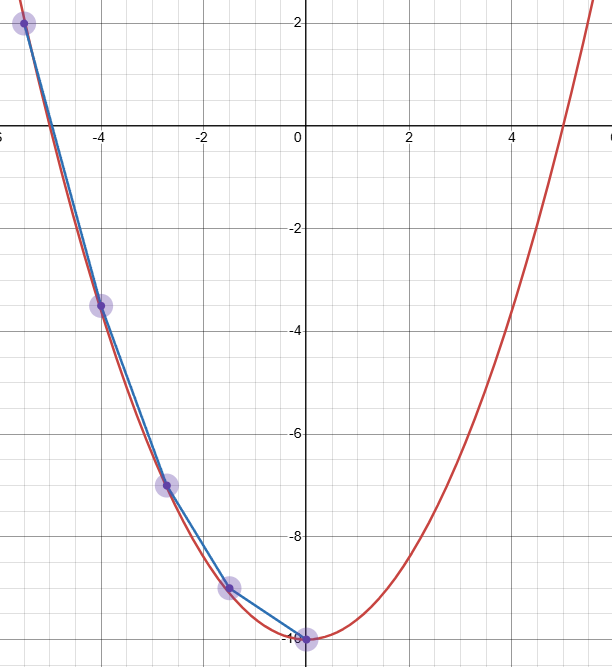
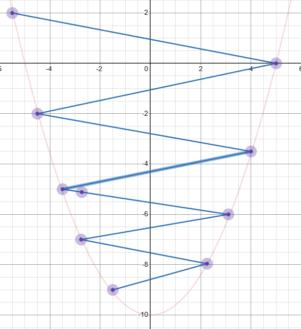
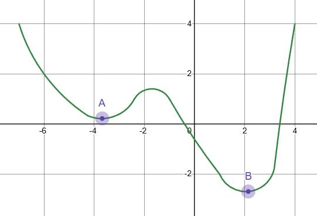

# 参数优化器

设有数据集A，其中每一个数据具有参数x1,x2,x3和离散标签y，我们希望寻找一个函数f，该函数f具有映射关系f(x1,x2,x3)=y
$$
数据集A=[a_{1}, a_{2},a_{3},...] \\
数据a=(x_{1},x_{2},x_{3},y) \\
求函数f,f(a)=y,f(A_{i})=f(a_{i})=f(x_{i1},x_{i2},x_{i3})=y_{i}
$$
以线性拟合为例
$$
函数f(a)=f(x_{i1},x_{i2},x_{i3})=z_1x_{i1}+z_2x_{i2}+z_3x_{i3}=y
$$
求得函数f即求得函数f的参数z1,z2,z3，最优化算法给出了一种方法

真实标签y和预测标签y‘有差异loss(y,y')，当loss无限趋近于0时，我们可以认为我们寻找到了一个函数f，f(a)=y

通过调整参数，来逐渐缩小loss，那么我们需要知道参数对loss的影响，也就是loss对参数求导
$$
\theta=\frac{\partial loss}{\partial z}
$$
即当θ大于0时，减小参数可使loss下降，当θ小于0时增大参数可使loss下降

如上所述，对参数的调整我们只知道进行增加或减少，但调整幅度依然未知，但有一点是清楚的，我们希望收敛过程迅速，也就是要以最大效率使得损失loss下降

## 方向导数和梯度

方向导数用于表达函数f在某点处沿某一方向上的变化率，设函数f(x,y)在点p(x0,y0)处可微分，则函数在该点沿任意方向的方向导数存在
$$
\frac{\partial f}{\partial l} \mid_{(x_0,y_0)}=f^{'}_{x}(x_0,y_0)\cos \alpha+f^{'}_{y}(x_0,y_0)\cos \beta
$$
用通俗的语言表达即为，参数x,y在点p处独立对函数f产生的影响在向量{cosα,cosβ}方向上的复合，从而描述了函数f在点p处沿向量{cosα,cosβ}方向上的单位变化率

向量{cosα,cosβ}是变化的，其中有一个向量方向可使函数在该方向上变化率最大，则这个向量方向称为梯度
$$
由向量点积a(a_1,a_2) \cdot b(b_1,b_2)=a_1b_1+a_2b_2 \quad \vec{a} \cdot \vec{b}=|a||b|\cos \angle(a,b) 得 \\
\begin{aligned}
\frac{\partial f}{\partial l} \mid_{(x_0,y_0)}&=f^{'}_{x}(x_0,y_0)\cos \alpha+f^{'}_{y}(x_0,y_0)\cos \beta \\
&= \{ \frac{\partial f}{\partial x}, \frac{\partial f}{\partial y} \} \cdot \{\cos \alpha ,\cos \beta \} \\ 
&=|\{ \frac{\partial f}{\partial x}, \frac{\partial f}{\partial y} \}||\{\cos \alpha ,\cos \beta \}| \cos \theta \\
已知cos \theta \in [-1,1]，当\theta=0时\cos \theta=1上式具有最大值
\end{aligned}
$$
上式中角θ是向量的夹角，当θ等于0意味着向量重合，即函数f沿着向量
$$
\{\frac{\partial f}{\partial x}, \frac{\partial f}{\partial y}\}
$$
方向变化速率最快，即该方向就是函数f的梯度

综上所述，深度学习问题递归优化参数实现函数收敛的过程中，应该沿函数梯度方向变化，即函数f的参数调整应当如下
$$
w_{new}=w_{old}-rate\cdot \frac{\partial Loss}{\partial w}
$$
该方法称为梯度下降法

## 优化器

我们虽然找到了迭代调整参数实现模型收敛的方法，但是模型沿着梯度方向每次调整的步长应该为多少呢？由于神经网络的发展和不同场景的需求，产生了许多种不同的参数调整策略，虽然都基于梯度下降。在深度学习框架中我们将种种调整策略模块称为参数优化器（optimizer）

最理想的模型拟合过程如下图所示

但是深度学习模型往往十分复杂，存在局部最优，并且当调整幅度过大会出现跳跃

如图所示A点为局部最优，B点为全局最优，模型可能收敛到局部最优的A点

出于对上述问题的考虑，提出了多种优化器策略

### SGD随机梯度下降

每次迭代选取数据集中的单个样本计算梯度，并据此更新参数，普通的SGD算法容易陷入局部最优，拟合过程存在较大波动。该算法具有如下变种和优化

#### mini-batch SGD

每次迭代使用一小批样本计算梯度，取均值用于更新参数，该算法通常能在效率和效果之间提供一个好的平衡

#### momentum动量

由上述梯度下降法可知，梯度指向的是局部最优，而非全局最优，而拟合过程中最主要的问题就来源于此，为了解决陷入局部最优以及拟合过程波动的问题，提出了动量法

momentum动量概念来自于物理学中的动量概念，用于刻画物体运动的状态，定义为物体质量和速度的乘积p=mv，动量具有矢量性，其方向与速度方向一致，多体系统的总动量是各物体动量的矢量和。从形式上看，动量算法引入了变量v充当速度角色，代表了参数在参数空间移动的方向和速率

动量法抛弃了一般SGD只使用当前梯度的方法，而是将过去的梯度也纳入当前节点的计算，就好像一个滑滑板的人，不断用脚蹬滑板，滑板不断积累过去的速率并朝着一个统一的方向运动，动量法SGD通过积累过去的梯度使得拟合过程沿着相对统一的方向前进，避免了病态的波动
$$
初始速度v=0 \\
v_{t}=\alpha v_{t-1} - \frac{\partial Loss}{\partial w} \\
w_{new}=w_{old}+rate*v_{t}
$$
学习率rate和动量参数α[0,1]越大，之前梯度对现在方向的影响越大，α通常设置为0.9

#### Nesterov动量

nesterov动量法是在传统动量法的基础上的改进，笼统的解释是，nesterov动量法提供了前瞻性

传统动量的梯度计算如下：
$$
\frac{\partial Loss}{\partial w}
$$
nesterov动量的梯度计算如下：
$$
\frac{\partial Loss}{\partial (w+\alpha v_{t-1})}
$$
可以看到nesterov动量法不在当前位置计算梯度，而是向动量方向“前进”后再计算梯度

nesterov动量法比传动动量法收敛速度更快，并更容易跳出鞍点

#### 参数范数惩罚

深度学习的目的是构建一个函数模型，尽可能的拟合应用场景中所涵盖的数据，但往往训练模型使用的数据只是真实数据中的部分采样，所以会出现一个奇怪的现象，模型在训练数据上表现良好，但是在真实场景中表现差劲，这就是所谓的过拟合。所以很多研究者设计出了多种策略来改善该问题，这些策略统称为正则化

许多正则化方法通过对目标函数Loss添加一个参数范数惩罚Ω(w)来限制模型的学习能力
$$
\bar{Loss}(w,x,y)=Loss(w,x,y)+\alpha \Omega(w)
$$
α是用于调整范数惩罚项Ω对目标函数影响的超参数，当α为0代表没有惩罚，α越大则代表惩罚越大。选择不同的参数范数惩罚Ω，会得到不同偏好的解

##### L2正则化

该正则化策略通过向目标函数Loss添加一个范数惩罚项Ω(w)
$$
\Omega(w)=\frac{1}{2} \|w \|_{2}^{2}
$$
该正则化策略也被称为“岭回归”，通常对于正则化策略的表现，我们通过目标函数的梯度来观察，对于L2正则化而言，其变化后的目标函数如下
$$
\bar{Loss}(w,x,y)=Loss(w,x,y)+\frac{\alpha}{2}w^{T}w
$$
则与之对应的梯度为
$$
\frac{\partial \bar{Loss}}{\partial w}=\frac{\partial Loss}{\partial w}+\alpha w
$$
对应的权重更新为
$$
\begin{aligned}
w_{new}&=w_{old}-rate*(\frac{\partial Loss}{\partial w}+\alpha w_{old}) \\
&=(1-\alpha)w_{old}-rate*\frac{\partial Loss}{\partial w}
\end{aligned}
$$
可以看到在梯度更新时先将原梯度进行缩放再进行调整，超参数α∈[0,1]

### Adam自适应矩估计

该方法结合了动量法和RMSProp自适应学习率

#### RMSProp自适应学习率

类似于动量法，RMSProp也要记录历史梯度信息
$$
R_{t}=\alpha R_{t-1}+(1-\alpha)G_{t}^{2} \\
\alpha 为超参数，(0,1)，用于控制历史梯度的影响程度 \\
G_{t}为当前梯度
$$

##### 参数更新

$$
w_{new}=w_{old}-\frac{lr}{\sqrt{R_{t}+0.00001}}G_{t}
$$

#### Adam优化器

##### 一阶矩估计

$$
m_{t}=\alpha_{1}m_{t-1}+(1-\alpha_{1})G_{t}
$$

##### 二阶矩估计

$$
r_{t}=\alpha_{2}r_{t-1}+(1-\alpha_2)G_{t}^{2}
$$

##### 偏差修正

由于m和r初始化为0，使得训练初期偏向于0，所以进行如下修正
$$
\hat{m_{t}}=\frac{m_{t}}{1-\alpha_{1}^{t}} \\
\hat{r_{t}}=\frac{r_{t}}{1-\alpha_{2}^{t}}
$$

##### 参数更新

$$
w_{new} =w_{old}-\frac{lr}{\sqrt{\hat{r_{t}}+0.00001}}\hat{m_{t}}
$$

#### AMSGrad

Adam使用指数平均保留历史梯度影响，其可能导致早期梯度对模型收敛具有绝对影响，而后期梯度对模型收敛无法产生影响，使得收敛过程动荡，甚至无法收敛

基于上述问题，AMSGrad给出调整策略，修改如下
$$
r_{t}=max(r_{t-1}, r_{t})
$$
