# 激活函数

激活函数加在神经网络每一层输出之后，作用于输出数据，将输出数据映射到非线性激活区。

激活函数的意义在于，在神经网络中加入非线性因素，突破线性函数表达能力的局限

## 常见激活函数

### STAIR

stair激活函数计算如下：

$$
stair(x)= \begin{cases} [x/2] && (mod([x],2)=0) \\
(x+[x])+[x/2] && (mod([x],2) \neq 0)\end{cases} \\
[x]表示不大于x的整数，mod(x,2)表示x对2取余
$$

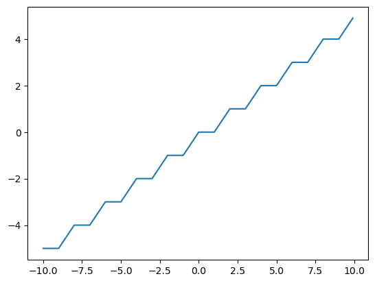

梯度计算：

$$
stair_{g}(x) = \begin{cases} 0 && [x]=x \\
1  && [x] \neq x\end{cases}
$$

### HARDTAN

hardtan激活函数计算如下：

$$
hardtan(x)=\begin{cases} -1 && (x< -1)\\
1 && (x>1) \\
x  && (x \in[-1,1]) \end{cases}
$$

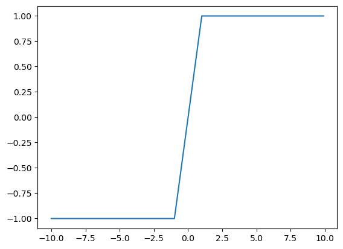

梯度计算：

$$
hardtan_{g}(x)=\begin{cases} 1 && x \in [-1,1] \\
0 && x \notin [-1,1] \end{cases}
$$

### LINEAR

linear激活函数计算如下：

$$
linear(x)=x
$$

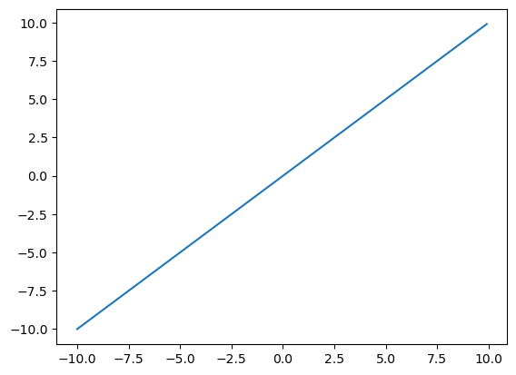

梯度计算：

$$
linear_{g}(x)=1
$$

### LOGISTIC

logistic激活函数计算如下：

$$
logistic(x)=\frac{1}{1+e^{-x}}
$$

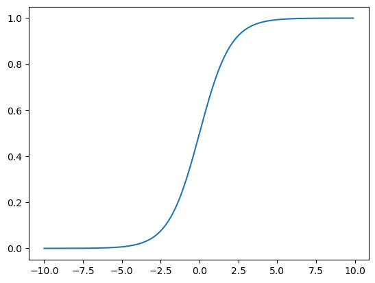

梯度计算：

$$
logistic_{g}(x)=(1-x)*x
$$

### LOGGY

loggy激活函数计算如下：

$$
loggy(x)=\frac{2}{1+e^{-x}}-1
$$

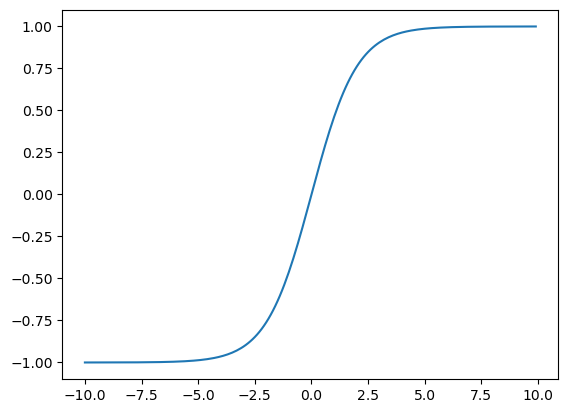

梯度计算：

$$
y = \frac{x+1}{2}\\
loggy_{g}(x)=2*(1-y)*y
$$

### RELU

relu激活函数计算如下：

$$
relu(x)= \begin{cases} x && x>0 \\
0 && x \leq 0\end{cases}
$$

梯度计算：

$$
relu_{g}(x)=\begin{cases} 1 && x>0 \\
0 && x \leq 0\end{cases}
$$

### ELU

elu激活函数计算如下：

$$
elu(x)= \begin{cases} x && x\ge 0 \\
e^{x}-1 && x<0\end{cases}
$$

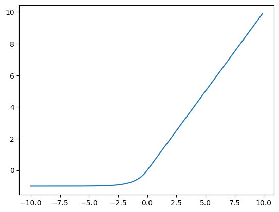

梯度计算：

$$
elu_{g}(x)=\begin{cases} 1 && x \ge 0 \\
x+1 && x<0\end{cases}
$$

### SELU

selu激活函数计算如下：

$$
selu(x)=\begin{cases} 1.0507*x && x \ge 0 \\
1.0507*1.6732*(e^{x}-1) && x<0\end{cases}
$$

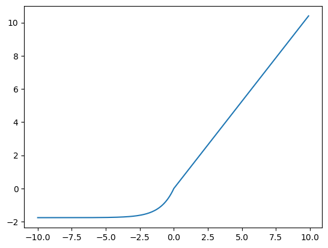

梯度计算：

$$
selu_{g}(x)=\begin{cases} 1.0507 && x \ge0 \\
x + 1.0507*1.6732 && x<0\end{cases}
$$

### RELIE

relie激活函数计算如下：

$$
relie(x)=\begin{cases} x && x>0 \\
0.01*x && x \leq 0\end{cases}
$$

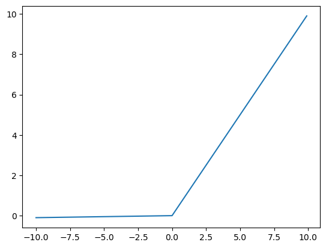

梯度计算：

$$
relie_{g}(x)=\begin{cases} 1 && x>0 \\
0.01 && x \leq 0 \end{cases}
$$

### RAMP

ramp激活函数计算如下：

$$
ramp(x)= \begin{cases} x+0.1*x && x>0 \\
0.1*x && x \leq 0 \end{cases}
$$

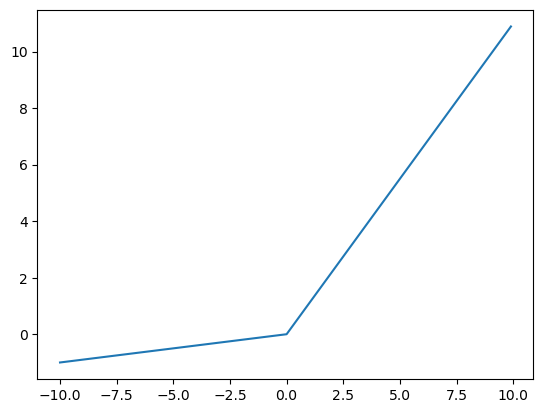

梯度计算：

$$
ramp_{g}(x)=\begin{cases} 1.1 && x>0 \\
0.1 && x \leq 0 \end{cases}
$$

### LEAKY RELU

leaky relu激活函数计算如下：

$$
leaky(x)=\begin{cases} x && x>0 \\
0.1*x && x \leq 0\end{cases}
$$

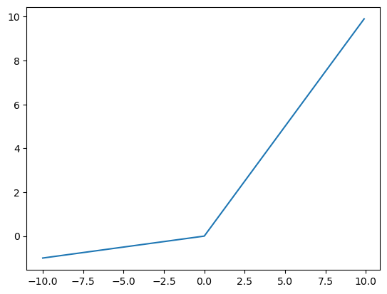

梯度计算：

$$
leaky_{g}(x)=\begin{cases} 1 && x>0 \\
0.1 && x \leq 0 \end{cases}
$$

### TANH

tanh激活函数计算如下：

$$
tanh(x)=\frac{e^{2x}-1}{e^{2x}+1}
$$

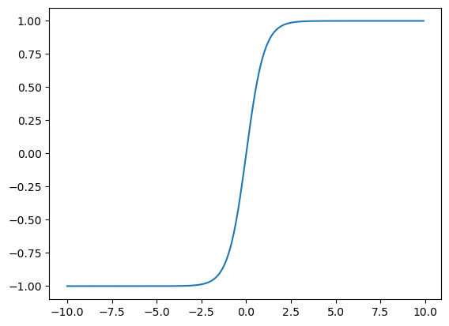

梯度计算：

$$
tanh_{g}(x)=1-x*x
$$

### PLSE

plse激活函数计算如下：

$$
plse(x)=\begin{cases} 0.01*(x+4) && x<-4 \\ 
0.01*(x-4)+1 && x>4 \\
0.125*x+0.5 && x \in [-4,4]\end{cases}
$$

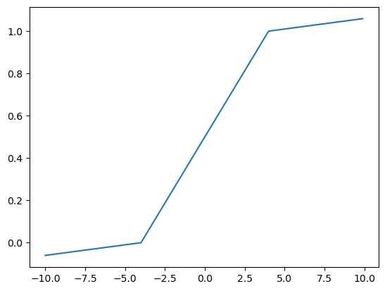

梯度计算：

$$
plse_{g}(x)=\begin{cases} 0.01 && x\in (-\infty,-4) \cup (4,+\infty) \\
0.125 && x \in [-4,4] \end{cases}
$$

### LHTAN

lhtan激活函数计算如下：

$$
lhtan(x)=\begin{cases} 0.001*x && x<0 \\
0.001*(x-1)+1 && x>1 \\
x && x \in [0,1] \end{cases}
$$

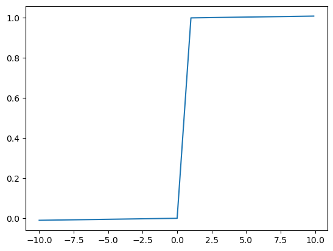

梯度计算：

$$
lhtan_{g}(x)=\begin{cases} 0.001 && x\in (-\infty,0) \cup (1,+\infty) \\
1 && x \in [0,1] \end{cases}
$$
