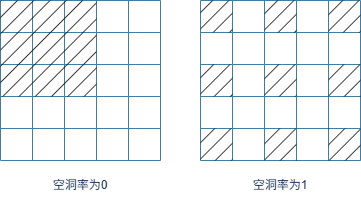
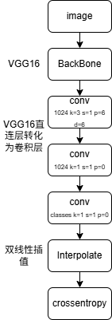
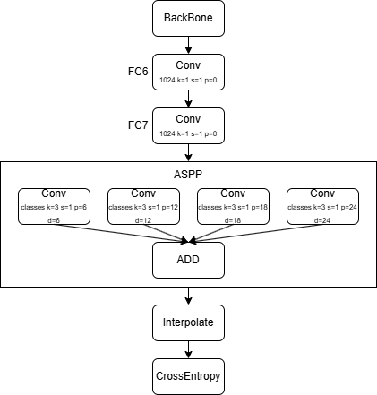
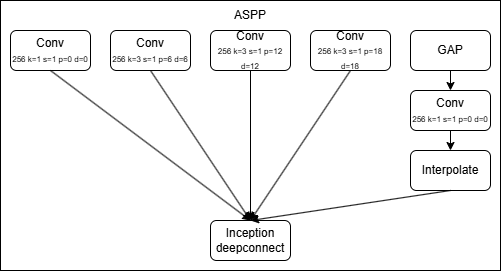
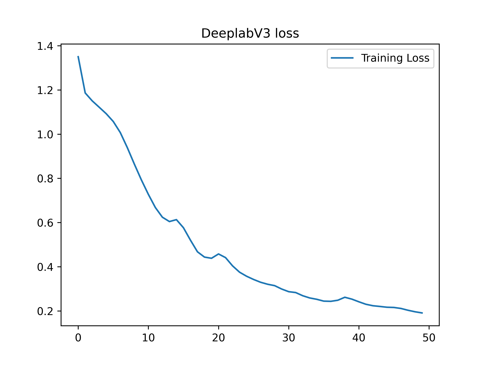
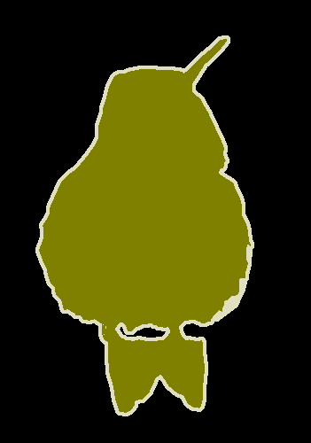
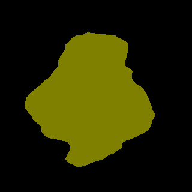

# DeepLab——v1 v2 v3

deeplab是语义分割领域经典CNN模型，DeepLabV3+是工业界最主流的模型选择，也是大模型时代的基线网络之一，v3+至今仍广泛使用

### DeepLabv1

《Semantic Image Segmentation with Deep Convolutional Nets and Fully Connected CRFs》2014，采用CNN特征提取+CRF精细修复，首次将空洞卷积引入分割任务

**空洞卷积**

DeepLabv1 首创用于分割，解决下采样丢失分辨率问题，其原理如下所示



3x3的卷积核，dilation=2等效为5x5卷积核的感受野，在不做填充的情况下，有些像素永不参与计算，这对类似分割任务这种像素精度的模型是不友好的，所以空洞卷积必须填充，填充大小等于空洞率

**空洞SPP**

对空洞卷积输出的特征图并行做多尺度平均池化，捕捉不同大小物体特征，融合后提升多尺度分割精度

**全连接条件随机场CRF**

修复轮廓、细化物体边缘，消除模糊区域，该技术在后续算法被弃用，所以Lumos框架并未支持

其网络结构如下：




### DeepLabv2

DeepLabv2是Google团队2016年提出的语义分割模型，核心是空洞卷积 + ASPP + 全连接 CRF，以 ResNet-101 为主干，在 PASCAL VOC 2012上达79.7% mIoU

对比 DeepLabv1（VGG-16）提升约4%，主干更强 + ASPP 更优，对比同期模型：优于 FCN、SegNet，接近 PSPNet

其网络结构如下：




### DeepLabv3

DeepLab v3是Google团队2017年提出的语义分割模型，核心是用空洞卷积（Atrous Convolution）+ 改进ASPP 模块，在不丢失分辨率的前提下捕捉多尺度上下文，无需 CRF 后处理也能达到高精度

改进ASPP模块结构如下：




### VOC2012数据集

PASCAL VOC（Visual Object Classes）是计算机视觉经典基准数据集，VOC2012是该系列最终稳定版本，广泛用于图像分类、目标检测、语义分割、实例分割、人体动作识别四大任务

官方主页：http://host.robots.ox.ac.uk/pascal/VOC/voc2012/

总图片数量：17125 张（train+val），压缩包约 1.9GB

适用场景：轻量模型训练、算法对比、入门实验；工业大数据场景一般搭配 COCO 使用

行业通用组合：VOC2007trainval + VOC2012trainval 混合训练，VOC2007 test 做评测

数据集包含20类图像，分割任务增加背景类为21类


### 代码构建

使用Lumos框架构建DeepLabV3模型

```c
layers[0] = make_convolutional_layer(64, 3, 1, 1, 0, 1, "relu");
layers[1] = make_convolutional_layer(64, 3, 1, 1, 0, 1, "relu");
layers[2] = make_maxpool_layer(2, 2, 0);

layers[3] = make_convolutional_layer(128, 3, 1, 1, 0, 1, "relu");
layers[4] = make_convolutional_layer(128, 3, 1, 1, 0, 1, "relu");
layers[5] = make_maxpool_layer(2, 2, 0);

layers[6] = make_convolutional_layer(256, 3, 1, 1, 0, 1, "relu");
layers[7] = make_convolutional_layer(256, 3, 1, 1, 0, 1, "relu");
layers[8] = make_convolutional_layer(256, 3, 1, 1, 0, 1, "relu");
layers[9] = make_maxpool_layer(2, 2, 0);
// pool3
layers[10] = make_convolutional_layer(512, 3, 1, 1, 0, 1, "relu");
layers[11] = make_convolutional_layer(512, 3, 1, 1, 0, 1, "relu");
layers[12] = make_convolutional_layer(512, 3, 1, 1, 0, 1, "relu");
layers[13] = make_maxpool_layer(2, 1, 1);
// pool4
layers[14] = make_convolutional_layer(512, 3, 1, 2, 2, 1, "relu");
layers[15] = make_convolutional_layer(512, 3, 1, 2, 2, 1, "relu");
layers[16] = make_convolutional_layer(512, 3, 1, 2, 2, 1, "relu");
layers[17] = make_maxpool_layer(2, 1, 1);
//ASPP模块
//x1
layers[18] = make_convolutional_layer(256, 1, 1, 0, 0, 0, "relu");
//x2
layers[19] = make_shortcut_layer(layers[18], 1, "linear");
layers[20] = make_convolutional_layer(256, 3, 1, 6, 6, 0, "relu");
//x3
layers[21] = make_shortcut_layer(layers[18], 1, "linear");
layers[22] = make_convolutional_layer(256, 3, 1, 12, 12, 0, "relu");
//x4
layers[23] = make_shortcut_layer(layers[18], 1, "linear");
layers[24] = make_convolutional_layer(256, 3, 1, 18, 18, 0, "relu");
//x5
layers[25] = make_shortcut_layer(layers[18], 1, "linear");
layers[26] = make_avgpool_layer(36, 36, 0);
layers[27] = make_convolutional_layer(256, 1, 1, 0, 0, 0, "relu");
layers[28] = make_interpolate_layer(36, 36);
Layer **aspp = malloc(5*sizeof(Layer*));
layers[29] = make_inception_layer(aspp, 5, 2);
aspp[0] = layers[19];
aspp[1] = layers[21];
aspp[2] = layers[23];
aspp[3] = layers[25];
aspp[4] = layers[29];
// project
layers[30] = make_convolutional_layer(256, 1, 1, 0, 0, 0, "relu");
layers[31] = make_dropout_layer(0.5);

layers[32] = make_convolutional_layer(256, 3, 1, 1, 0, 0, "relu");
layers[33] = make_convolutional_layer(num_class, 1, 1, 0, 0, 0, "linear");
layers[34] = make_interpolate_layer(320, 320);
layers[35] = make_crossentropy_layer(NULL, -1);
```

该模型实现以VGG16作为骨干网络，使用crossentropy分类器

除骨干网络需要加载预训练参数外，其余卷积层均采用Kaiming初始化，bias置0

```c
for (int i = 0; i < 36; ++i){
    append_layer2grpah(graph, layers[i]);
    Layer *l = layers[i];
    if (l->type == CONVOLUTIONAL){
        init_kaiming_uniform_kernel(l, 0, "fan_in", "relu");
        init_constant_bias(l, 0);
    }
}
```

会话构建及训练超参数设置

```c
Session *sess = create_session(graph, 320, 320, 3, 320*320, num_class, type, path);
float *mean = calloc(3, sizeof(float));
float *std = calloc(3, sizeof(float));
mean[0] = 0.485;
mean[1] = 0.456;
mean[2] = 0.406;
std[0] = 0.229;
std[1] = 0.224;
std[2] = 0.225;
transform_normalize_sess(sess, mean, std);
transform_resize_sess(sess, 320, 320);
set_train_params(sess, 50, 8, 8, 0.001);
SGDOptimizer_sess(sess, 0.9, 0, 5e-4, 0, 0);
init_session(sess, "./data/VOC2012/train.txt", "./data/VOC2012/train_label.txt");
train(sess);
```

在Lumos框架中demo目录下，您能找到deeplabv3.c文件，这就是我们已实现的deeplabv3模型


### 结果展示





