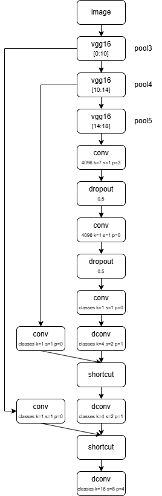
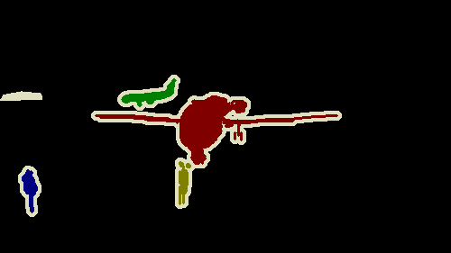
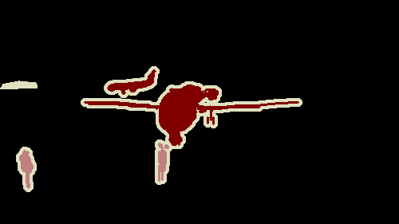
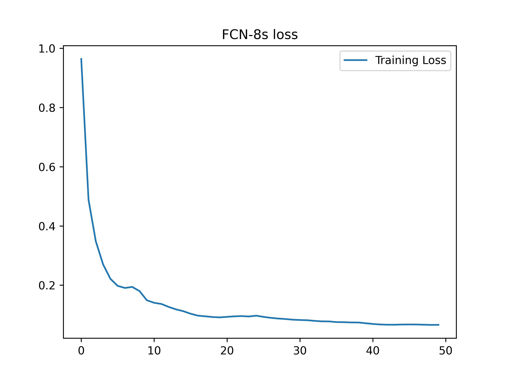
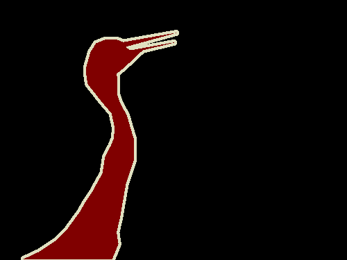
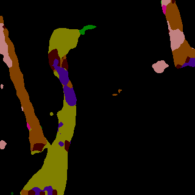

# FCN

FCN（Fully Convolutional Networks，全卷积网络）是CNN语义分割开山之作，FCN-8s是其最终优化版本，像素级分类、多尺度融合、上采样弥补细节

传统分类网络（VGG、AlexNet）末尾是全连接层，输出单类别；FCN把全连接全部替换为卷积，让网络可接收任意尺寸输入，输出和原图等尺寸的分割热力图，实现端到端语义分割。

FCN分3个版本：FCN-32s → FCN-16s → FCN-8s（精度最高、最常用）

FCN-8s 核心：跳层融合 + 8 倍上采样

| 版本    | 融合层                | 最终上采样 | 效果               |
| ------- | --------------------- | ---------- | ------------------ |
| FCN-32s | 仅 pool5              | 32 倍      | 最差，边缘粗糙     |
| FCN-16s | pool5 + pool4         | 16 倍      | 中等               |
| FCN-8s  | pool5 + pool4 + pool3 | 8 倍       | 最优，工业经典基线 |

FCN-8s其网络结构如下：



### 创新与突破

首个端到端语义分割框架，奠定后续所有分割网络基础（U-Net、SegNet、DeepLab 均受其启发），任意尺寸输入，推理高效、结构简单，多尺度跳融合思路成为分割标配


### VOC2012数据集

PASCAL Visual Object Classes Challenge 2012，由牛津+剑桥共同发布，CV 领域里程碑式数据集

核心用途：图像分类、目标检测、语义分割、实例分割

图像来源：Flickr真实场景，分辨率约300–600像素






### 代码构建

使用Lumos框架构建FCN-8s网络模型

```c
int num_class = 21;
Graph *graph = create_graph();
Layer **layers = malloc(33*sizeof(Layer*));
layers[0] = make_convolutional_layer(64, 3, 1, 1, 1, "relu");
layers[1] = make_convolutional_layer(64, 3, 1, 1, 1, "relu");
layers[2] = make_maxpool_layer(2, 2, 0);

layers[3] = make_convolutional_layer(128, 3, 1, 1, 1, "relu");
layers[4] = make_convolutional_layer(128, 3, 1, 1, 1, "relu");
layers[5] = make_maxpool_layer(2, 2, 0);

layers[6] = make_convolutional_layer(256, 3, 1, 1, 1, "relu");
layers[7] = make_convolutional_layer(256, 3, 1, 1, 1, "relu");
layers[8] = make_convolutional_layer(256, 3, 1, 1, 1, "relu");
layers[9] = make_maxpool_layer(2, 2, 0);
// pool3
layers[10] = make_convolutional_layer(512, 3, 1, 1, 1, "relu");
layers[11] = make_convolutional_layer(512, 3, 1, 1, 1, "relu");
layers[12] = make_convolutional_layer(512, 3, 1, 1, 1, "relu");
layers[13] = make_maxpool_layer(2, 2, 0);
// pool4
layers[14] = make_convolutional_layer(512, 3, 1, 1, 1, "relu");
layers[15] = make_convolutional_layer(512, 3, 1, 1, 1, "relu");
layers[16] = make_convolutional_layer(512, 3, 1, 1, 1, "relu");
layers[17] = make_maxpool_layer(2, 2, 0);
// pool5
layers[18] = make_convolutional_layer(4096, 7, 1, 3, 1, "relu"); // fc6
layers[19] = make_dropout_layer(0.5);
layers[20] = make_convolutional_layer(4096, 1, 1, 0, 1, "relu"); // fc7
layers[21] = make_dropout_layer(0.5);
// 跳跃连接+上采样
layers[22] = make_convolutional_layer(num_class, 1, 1, 0, 1, "linear"); // score_fr
layers[23] = make_deconvolutional_layer(num_class, 4, 2, 1, 0, "linear"); // up2

layers[24] = make_shortcut_layer(layers[14], 1, "linear");
layers[25] = make_convolutional_layer(num_class, 1, 1, 0, 1, "linear"); // score_pool4
layers[26] = make_shortcut_layer(layers[24], 0, "linear"); // fuse1

layers[27] = make_deconvolutional_layer(num_class, 4, 2, 1, 0, "linear"); // up4

layers[28] = make_shortcut_layer(layers[10], 1, "linear");
layers[29] = make_convolutional_layer(num_class, 1, 1, 0, 1, "linear"); // score_pool3
layers[30] = make_shortcut_layer(layers[28], 0, "linear");

layers[31] = make_deconvolutional_layer(num_class, 16, 8, 4, 0, "linear");
layers[32] = make_crossentropy_layer(NULL, 255);
```

我们使用crossentropy分类器进行分类

特征提取层（VGG前18层）使用VGG预训练权重，上采样deconvolutional采用双线性插值初始化，其余卷积层采用随机初始化

```c
for (int i = 0; i < 33; ++i){
    append_layer2grpah(graph, layers[i]);
    Layer *l = layers[i];
    if (l->type == CONVOLUTIONAL){
        init_kaiming_uniform_kernel(l, 0, "fan_in", "relu");
        init_constant_bias(l, 0);
    }
    if (l->type == DECONVOLUTIONAL){
        init_bilinearinterp_kernel(l);
    }
}
```

接下来创建会话，并设置相关训练超参数

```c
Session *sess = create_session(graph, 320, 320, 3, 320*320, num_class, type, path);
float *mean = calloc(3, sizeof(float));
float *std = calloc(3, sizeof(float));
mean[0] = 0.485;
mean[1] = 0.456;
mean[2] = 0.406;
std[0] = 0.229;
std[1] = 0.224;
std[2] = 0.225;
transform_normalize_sess(sess, mean, std);
transform_resize_sess(sess, 320, 320);
set_train_params(sess, 200, 20, 20, 1e-4);
SGDOptimizer_sess(sess, 0.9, 0, 2e-4, 0, 0);
init_session(sess, "./data/VOC2012/train.txt", "./data/VOC2012/train_label.txt");
train(sess);
```

可以看到我们对数据集进行了一定的预处理操作，首先对数据集进行归一化，归一化的分布来自于ImageNet数据集的先验计算结果，后续我们对数据集进行缩放，使其符合网络模型输入

我们使用SGD参数优化器进行参数优化

完整代码如下

```c
#include "fcn8.h"

void fcn8(char *type, char *path)
{
    int num_class = 21;
    Graph *graph = create_graph();
    Layer **layers = malloc(33*sizeof(Layer*));
    layers[0] = make_convolutional_layer(64, 3, 1, 1, 1, "relu");
    layers[1] = make_convolutional_layer(64, 3, 1, 1, 1, "relu");
    layers[2] = make_maxpool_layer(2, 2, 0);

    layers[3] = make_convolutional_layer(128, 3, 1, 1, 1, "relu");
    layers[4] = make_convolutional_layer(128, 3, 1, 1, 1, "relu");
    layers[5] = make_maxpool_layer(2, 2, 0);

    layers[6] = make_convolutional_layer(256, 3, 1, 1, 1, "relu");
    layers[7] = make_convolutional_layer(256, 3, 1, 1, 1, "relu");
    layers[8] = make_convolutional_layer(256, 3, 1, 1, 1, "relu");
    layers[9] = make_maxpool_layer(2, 2, 0);
    // pool3
    layers[10] = make_convolutional_layer(512, 3, 1, 1, 1, "relu");
    layers[11] = make_convolutional_layer(512, 3, 1, 1, 1, "relu");
    layers[12] = make_convolutional_layer(512, 3, 1, 1, 1, "relu");
    layers[13] = make_maxpool_layer(2, 2, 0);
    // pool4
    layers[14] = make_convolutional_layer(512, 3, 1, 1, 1, "relu");
    layers[15] = make_convolutional_layer(512, 3, 1, 1, 1, "relu");
    layers[16] = make_convolutional_layer(512, 3, 1, 1, 1, "relu");
    layers[17] = make_maxpool_layer(2, 2, 0);
    // pool5
    layers[18] = make_convolutional_layer(4096, 7, 1, 3, 1, "relu"); // fc6
    layers[19] = make_dropout_layer(0.5);
    layers[20] = make_convolutional_layer(4096, 1, 1, 0, 1, "relu"); // fc7
    layers[21] = make_dropout_layer(0.5);
    // 跳跃连接+上采样
    layers[22] = make_convolutional_layer(num_class, 1, 1, 0, 1, "linear"); // score_fr
    layers[23] = make_deconvolutional_layer(num_class, 4, 2, 1, 0, "linear"); // up2

    layers[24] = make_shortcut_layer(layers[14], 1, "linear");
    layers[25] = make_convolutional_layer(num_class, 1, 1, 0, 1, "linear"); // score_pool4
    layers[26] = make_shortcut_layer(layers[24], 0, "linear"); // fuse1

    layers[27] = make_deconvolutional_layer(num_class, 4, 2, 1, 0, "linear"); // up4

    layers[28] = make_shortcut_layer(layers[10], 1, "linear");
    layers[29] = make_convolutional_layer(num_class, 1, 1, 0, 1, "linear"); // score_pool3
    layers[30] = make_shortcut_layer(layers[28], 0, "linear");

    layers[31] = make_deconvolutional_layer(num_class, 16, 8, 4, 0, "linear");
    layers[32] = make_crossentropy_layer(NULL, 255);

    for (int i = 0; i < 33; ++i){
        append_layer2grpah(graph, layers[i]);
        Layer *l = layers[i];
        if (l->type == CONVOLUTIONAL){
            init_kaiming_uniform_kernel(l, 0, "fan_in", "relu");
            init_constant_bias(l, 0);
        }
        if (l->type == DECONVOLUTIONAL){
            init_bilinearinterp_kernel(l);
        }
    }
    Session *sess = create_session(graph, 320, 320, 3, 320*320, num_class, type, path);
    float *mean = calloc(3, sizeof(float));
    float *std = calloc(3, sizeof(float));
    mean[0] = 0.485;
    mean[1] = 0.456;
    mean[2] = 0.406;
    std[0] = 0.229;
    std[1] = 0.224;
    std[2] = 0.225;
    transform_normalize_sess(sess, mean, std);
    transform_resize_sess(sess, 320, 320);
    set_train_params(sess, 200, 20, 20, 1e-4);
    SGDOptimizer_sess(sess, 0.9, 0, 2e-4, 0, 0);
    init_session(sess, "./data/VOC2012/train.txt", "./data/VOC2012/train_label.txt");
    train(sess);
}

void fcn8_detect(char *type, char *path)
{
    int num_class = 21;
    Graph *graph = create_graph();
    Layer **layers = malloc(33*sizeof(Layer*));
    layers[0] = make_convolutional_layer(64, 3, 1, 1, 1, "relu");
    layers[1] = make_convolutional_layer(64, 3, 1, 1, 1, "relu");
    layers[2] = make_maxpool_layer(2, 2, 0);

    layers[3] = make_convolutional_layer(128, 3, 1, 1, 1, "relu");
    layers[4] = make_convolutional_layer(128, 3, 1, 1, 1, "relu");
    layers[5] = make_maxpool_layer(2, 2, 0);

    layers[6] = make_convolutional_layer(256, 3, 1, 1, 1, "relu");
    layers[7] = make_convolutional_layer(256, 3, 1, 1, 1, "relu");
    layers[8] = make_convolutional_layer(256, 3, 1, 1, 1, "relu");
    layers[9] = make_maxpool_layer(2, 2, 0);
    // pool3
    layers[10] = make_convolutional_layer(512, 3, 1, 1, 1, "relu");
    layers[11] = make_convolutional_layer(512, 3, 1, 1, 1, "relu");
    layers[12] = make_convolutional_layer(512, 3, 1, 1, 1, "relu");
    layers[13] = make_maxpool_layer(2, 2, 0);
    // pool4
    layers[14] = make_convolutional_layer(512, 3, 1, 1, 1, "relu");
    layers[15] = make_convolutional_layer(512, 3, 1, 1, 1, "relu");
    layers[16] = make_convolutional_layer(512, 3, 1, 1, 1, "relu");
    layers[17] = make_maxpool_layer(2, 2, 0);
    // pool5
    layers[18] = make_convolutional_layer(4096, 7, 1, 3, 1, "relu"); // fc6
    layers[19] = make_dropout_layer(0.5);
    layers[20] = make_convolutional_layer(4096, 1, 1, 0, 1, "relu"); // fc7
    layers[21] = make_dropout_layer(0.5);
    // 跳跃连接+上采样
    layers[22] = make_convolutional_layer(num_class, 1, 1, 0, 1, "linear"); // score_fr
    layers[23] = make_deconvolutional_layer(num_class, 4, 2, 1, 0, "linear"); // up2

    layers[24] = make_shortcut_layer(layers[14], 1, "linear");
    layers[25] = make_convolutional_layer(num_class, 1, 1, 0, 1, "linear"); // score_pool4
    layers[26] = make_shortcut_layer(layers[24], 0, "linear"); // fuse1

    layers[27] = make_deconvolutional_layer(num_class, 4, 2, 1, 0, "linear"); // up4

    layers[28] = make_shortcut_layer(layers[10], 1, "linear");
    layers[29] = make_convolutional_layer(num_class, 1, 1, 0, 1, "linear"); // score_pool3
    layers[30] = make_shortcut_layer(layers[28], 0, "linear");

    layers[31] = make_deconvolutional_layer(num_class, 16, 8, 4, 0, "linear");
    layers[32] = make_crossentropy_layer(NULL, 255);

    for (int i = 0; i < 33; ++i){
        append_layer2grpah(graph, layers[i]);
    }

    Session *sess = create_session(graph, 320, 320, 3, 320*320, num_class, type, path);
    float *mean = calloc(3, sizeof(float));
    float *std = calloc(3, sizeof(float));
    mean[0] = 0.485;
    mean[1] = 0.456;
    mean[2] = 0.406;
    std[0] = 0.229;
    std[1] = 0.224;
    std[2] = 0.225;
    transform_normalize_sess(sess, mean, std);
    transform_resize_sess(sess, 320, 320);
    set_detect_params(sess);
    init_session(sess, "./data/VOC2012/train.txt", "./data/VOC2012/train_label.txt");
    detect_segmentation(sess);
}
```

在Lumos框架中demo目录下，您能找到fcn8.c文件，这就是我们已实现的fcn-8s模型

```c
fcn8("gpu", "VGG.lw")
```


### 结果展示

测试超参数为：lr（0.001）batch（4）decay（1e-4）momentum（0.9）epoch（50）






