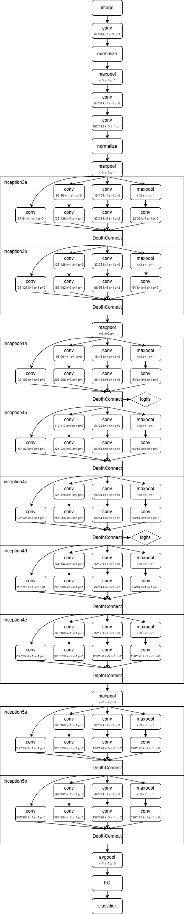
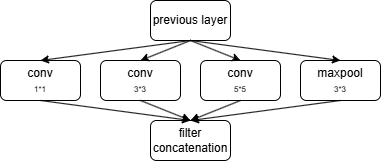
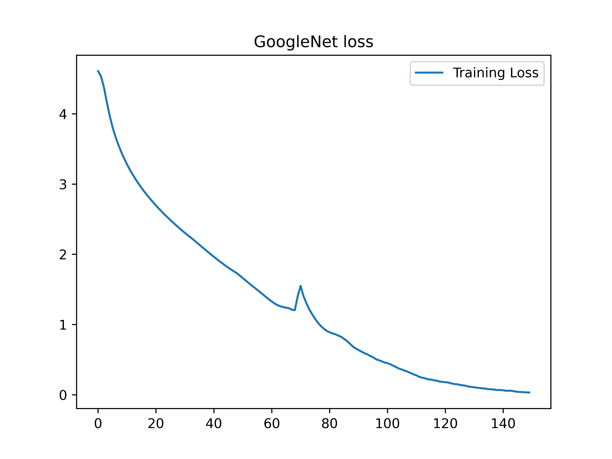

# GoogleNet

GoogLeNet（又称 Inception v1） 是 Google 团队在2014 年提出的深度卷积神经网络，论文《Going Deeper with Convolutions》

- 比赛成绩：ILSVRC 2014图像分类冠军，top-5错误率6.67%（无外部数据）

- 网络深度：22层（参数约为AlexNet的1/12、VGG的1/3）

- 核心亮点：Inception模块用 “并行多尺度卷积 + 1×1 降维” 提升效率、控制计算量

其网络结构如下：



### 创新与突破

在GoogLeNet之前（AlexNet、VGG），主流思路是堆深度，导致：

1. 计算量爆炸：参数过多，训练 / 推理慢
2. 梯度消失：深层网络难以训练
3. 过拟合：模型太复杂

GoogLeNet思路：“宽” 而非 “深”—— 同一层并行提取多尺度特征，在相同计算量下获得更强表达能力

**Inception 模块（并行多尺度 + 降维）**



分支 1：1×1 卷积：直接跨通道融合、降维

分支 2：1×1→3×3 卷积：先降维再卷积，减少计算

分支 3：1×1→5×5 卷积：捕捉更大范围特征

分支 4：3×3 最大池化→1×1 卷积：池化后降维，保留空间信息

输出：4 条分支在channel维度拼接，形成多尺度特征图

**优点**

- 高效轻量：参数少、计算量低，适合部署
- 多尺度特征：并行捕捉细节与全局信息
- 泛化性好：GAP+Dropout + 辅助分类器，正则化强

**缺点**

- 结构复杂：分支多、设计 / 调参难度大
- 深层梯度仍易消失：不如后续 ResNet 的残差连接
- 训练技巧多：需精细调学习率、权重衰减等


### Inception模块构建

您需要使用shortcut_layer和inception_layer来构建Inception模块，如下所示

```c
l1 = make_convolutional_layer(64, 1, 1, 0, 1, "relu");

l2 = make_shortcut_layer(l1, 1, "linear");
l3 = make_convolutional_layer(96, 1, 1, 0, 1, "relu");
l3 = make_convolutional_layer(128, 3, 1, 1, 1, "relu");

l5 = make_shortcut_layer(l1, 1, "linear");
l6 = make_convolutional_layer(16, 1, 1, 0, 1, "relu");
l7 = make_convolutional_layer(32, 5, 1, 2, 1, "relu");

l8 = make_shortcut_layer(l1, 1, "linear");
l9 = make_maxpool_layer(3, 1, 1);
l10 = make_convolutional_layer(32, 1, 1, 0, 1, "relu");

Layer **inception3a = malloc(4*sizeof(Layer*));
l11 = make_inception_layer(inception3a, 4, 2);
inception3a[0] = ls[2];
inception3a[1] = ls[5];
inception3a[2] = ls[8];
inception3a[3] = ls[11];
```

shortcut_layer模式一直接获取链接层的输入，inception_layer实现多层计算结果的合并

Lumos框架中数据按照[width:0,height:1,channel:2,batch:3]组织，所以inception_layer按照channel进行合并时，dim参数设置为2


### CIFAR100数据集

CIFAR-100（Canadian Institute for Advanced Research）是2009年由 Alex Krizhevsky 等人发布的32×32彩色小图分类基准，是CIFAR-10的扩展，类别更多、粒度更细、难度更高

**基本信息**

- 总图像数：60,000 张（RGB 彩色，`32×32×3`，`uint8`）
- 训练集：50,000 张（100 类，每类 500 张）
- 测试集：10,000 张（100 类，每类 100 张）
- 类别数：100 个细类（fine），归为20个超类（coarse），每超类含5个子类


下载地址：[CIFAR-10 and CIFAR-100 datasets](https://www.cs.toronto.edu/~kriz/cifar.html)


### 代码构建

使用Lumos框架构建网络模型，该实例中我们省略了辅助分类器

```c
Graph *graph = create_graph();
Layer **ls = malloc(112*sizeof(Layer*));
ls[0] = make_convolutional_layer(64, 7, 2, 3, 0, "linear");
ls[1] = make_normalization_layer(0.1, 1, "relu");
ls[2] = make_maxpool_layer(3, 2, 1);
ls[3] = make_convolutional_layer(64, 1, 1, 0, 1, "relu");
ls[4] = make_convolutional_layer(192, 3, 1, 1, 0, "linear");
ls[5] = make_normalization_layer(0.1, 1, "relu");
ls[6] = make_maxpool_layer(3, 2, 1);

ls[7] = make_convolutional_layer(64, 1, 1, 0, 1, "relu");

ls[8] = make_shortcut_layer(ls[7], 1, "linear");
ls[9] = make_convolutional_layer(96, 1, 1, 0, 1, "relu");
ls[10] = make_convolutional_layer(128, 3, 1, 1, 1, "relu");

ls[11] = make_shortcut_layer(ls[7], 1, "linear");
ls[12] = make_convolutional_layer(16, 1, 1, 0, 1, "relu");
ls[13] = make_convolutional_layer(32, 5, 1, 2, 1, "relu");

ls[14] = make_shortcut_layer(ls[7], 1, "linear");
ls[15] = make_maxpool_layer(3, 1, 1);
ls[16] = make_convolutional_layer(32, 1, 1, 0, 1, "relu");

Layer **inception3a = malloc(4*sizeof(Layer*));
ls[17] = make_inception_layer(inception3a, 4, 2);
inception3a[0] = ls[8];
inception3a[1] = ls[11];
inception3a[2] = ls[14];
inception3a[3] = ls[17];

ls[18] = make_convolutional_layer(128, 1, 1, 0, 1, "relu"); // 16

ls[19] = make_shortcut_layer(ls[18], 1, "linear");
ls[20] = make_convolutional_layer(128, 1, 1, 0, 1, "relu");
ls[21] = make_convolutional_layer(192, 3, 1, 1, 1, "relu");

ls[22] = make_shortcut_layer(ls[18], 1, "linear");
ls[23] = make_convolutional_layer(32, 1, 1, 0, 1, "relu");
ls[24] = make_convolutional_layer(96, 5, 1, 2, 1, "relu");

ls[25] = make_shortcut_layer(ls[18], 1, "linear");
ls[26] = make_maxpool_layer(3, 1, 1);
ls[27] = make_convolutional_layer(64, 1, 1, 0, 1, "relu");

Layer **inception3b = malloc(4*sizeof(Layer*));
ls[28] = make_inception_layer(inception3b, 4, 2);
inception3b[0] = ls[19];
inception3b[1] = ls[22];
inception3b[2] = ls[25];
inception3b[3] = ls[28];

ls[29] = make_maxpool_layer(3, 2, 1); // 27

ls[30] = make_convolutional_layer(192, 1, 1, 0, 1, "relu");

ls[31] = make_shortcut_layer(ls[30], 1, "linear");
ls[32] = make_convolutional_layer(96, 1, 1, 0, 1, "relu");
ls[33] = make_convolutional_layer(208, 3, 1, 1, 1, "relu");

ls[34] = make_shortcut_layer(ls[30], 1, "linear");
ls[35] = make_convolutional_layer(16, 1, 1, 0, 1, "relu");
ls[36] = make_convolutional_layer(48, 5, 1, 2, 1, "relu");

ls[37] = make_shortcut_layer(ls[30], 1, "linear");
ls[38] = make_maxpool_layer(3, 1, 1);
ls[39] = make_convolutional_layer(64, 1, 1, 0, 1, "relu");

Layer **inception4a = malloc(4*sizeof(Layer*));
ls[40] = make_inception_layer(inception4a, 4, 2);
inception4a[0] = ls[31];
inception4a[1] = ls[34];
inception4a[2] = ls[37];
inception4a[3] = ls[40];

// 辅助分类器位置
ls[41] = make_convolutional_layer(160, 1, 1, 0, 1, "relu"); // 39

ls[42] = make_shortcut_layer(ls[41], 1, "linear");
ls[43] = make_convolutional_layer(112, 1, 1, 0, 1, "relu");
ls[44] = make_convolutional_layer(224, 3, 1, 1, 1, "relu");

ls[45] = make_shortcut_layer(ls[41], 1, "linear");
ls[46] = make_convolutional_layer(24, 1, 1, 0, 1, "relu");
ls[47] = make_convolutional_layer(64, 5, 1, 2, 1, "relu");

ls[48] = make_shortcut_layer(ls[41], 1, "linear");
ls[49] = make_maxpool_layer(3, 1, 1);
ls[50] = make_convolutional_layer(64, 1, 1, 0, 1, "relu");

Layer **inception4b = malloc(4*sizeof(Layer*));
ls[51] = make_inception_layer(inception4b, 4, 2);
inception4b[0] = ls[42];
inception4b[1] = ls[45];
inception4b[2] = ls[48];
inception4b[3] = ls[51];

ls[52] = make_convolutional_layer(128, 1, 1, 0, 1, "relu"); // 50

ls[53] = make_shortcut_layer(ls[52], 1, "linear");
ls[54] = make_convolutional_layer(128, 1, 1, 0, 1, "relu");
ls[55] = make_convolutional_layer(256, 3, 1, 1, 1, "relu");

ls[56] = make_shortcut_layer(ls[52], 1, "linear");
ls[57] = make_convolutional_layer(24, 1, 1, 0, 1, "relu");
ls[58] = make_convolutional_layer(64, 5, 1, 2, 1, "relu");

ls[59] = make_shortcut_layer(ls[52], 1, "linear");
ls[60] = make_maxpool_layer(3, 1, 1);
ls[61] = make_convolutional_layer(64, 1, 1, 0, 1, "relu");

Layer **inception4c = malloc(4*sizeof(Layer*));
ls[62] = make_inception_layer(inception4c, 4, 2);
inception4c[0] = ls[53];
inception4c[1] = ls[56];
inception4c[2] = ls[59];
inception4c[3] = ls[62];

ls[63] = make_convolutional_layer(112, 1, 1, 0, 1, "relu"); // 61

ls[64] = make_shortcut_layer(ls[63], 1, "linear");
ls[65] = make_convolutional_layer(144, 1, 1, 0, 1, "relu");
ls[66] = make_convolutional_layer(288, 3, 1, 1, 1, "relu");

ls[67] = make_shortcut_layer(ls[63], 1, "linear");
ls[68] = make_convolutional_layer(32, 1, 1, 0, 1, "relu");
ls[69] = make_convolutional_layer(64, 5, 1, 2, 1, "relu");

ls[70] = make_shortcut_layer(ls[63], 1, "linear");
ls[71] = make_maxpool_layer(3, 1, 1);
ls[72] = make_convolutional_layer(64, 1, 1, 0, 1, "relu");

Layer **inception4d = malloc(4*sizeof(Layer*));
ls[73] = make_inception_layer(inception4d, 4, 2);
inception4d[0] = ls[64];
inception4d[1] = ls[67];
inception4d[2] = ls[70];
inception4d[3] = ls[73];

// 辅助分类器位置
ls[74] = make_convolutional_layer(256, 1, 1, 0, 1, "relu"); // 72

ls[75] = make_shortcut_layer(ls[74], 1, "linear");
ls[76] = make_convolutional_layer(160, 1, 1, 0, 1, "relu");
ls[77] = make_convolutional_layer(320, 3, 1, 1, 1, "relu");

ls[78] = make_shortcut_layer(ls[74], 1, "linear");
ls[79] = make_convolutional_layer(32, 1, 1, 0, 1, "relu");
ls[80] = make_convolutional_layer(128, 5, 1, 2, 1, "relu");

ls[81] = make_shortcut_layer(ls[74], 1, "linear");
ls[82] = make_maxpool_layer(3, 1, 1);
ls[83] = make_convolutional_layer(128, 1, 1, 0, 1, "relu");

Layer **inception4e = malloc(4*sizeof(Layer*));
ls[84] = make_inception_layer(inception4e, 4, 2);
inception4e[0] = ls[75];
inception4e[1] = ls[78];
inception4e[2] = ls[81];
inception4e[3] = ls[84];

ls[85] = make_maxpool_layer(2, 2, 0); // 83 25

ls[86] = make_convolutional_layer(256, 1, 1, 0, 1, "relu");

ls[87] = make_shortcut_layer(ls[86], 1, "linear");
ls[88] = make_convolutional_layer(160, 1, 1, 0, 1, "relu");
ls[89] = make_convolutional_layer(320, 3, 1, 1, 1, "relu");

ls[90] = make_shortcut_layer(ls[86], 1, "linear");
ls[91] = make_convolutional_layer(32, 1, 1, 0, 1, "relu");
ls[92] = make_convolutional_layer(128, 5, 1, 2, 1, "relu");

ls[93] = make_shortcut_layer(ls[86], 1, "linear");
ls[94] = make_maxpool_layer(3, 1, 1);
ls[95] = make_convolutional_layer(128, 1, 1, 0, 1, "relu");

Layer **inception5a = malloc(4*sizeof(Layer*));
ls[96] = make_inception_layer(inception5a, 4, 2);
inception5a[0] = ls[87];
inception5a[1] = ls[90];
inception5a[2] = ls[93];
inception5a[3] = ls[96];

ls[97] = make_convolutional_layer(384, 1, 1, 0, 1, "relu"); // 95

ls[98] = make_shortcut_layer(ls[97], 1, "linear");
ls[99] = make_convolutional_layer(192, 1, 1, 0, 1, "relu");
ls[100] = make_convolutional_layer(384, 3, 1, 1, 1, "relu");

ls[101] = make_shortcut_layer(ls[97], 1, "linear");
ls[102] = make_convolutional_layer(48, 1, 1, 0, 1, "relu");
ls[103] = make_convolutional_layer(128, 5, 1, 2, 1, "relu");

ls[104] = make_shortcut_layer(ls[97], 1, "linear");
ls[105] = make_maxpool_layer(3, 1, 1);
ls[106] = make_convolutional_layer(128, 1, 1, 0, 1, "relu");

Layer **inception5b = malloc(4*sizeof(Layer*));
ls[107] = make_inception_layer(inception5b, 4, 2);
inception5b[0] = ls[98];
inception5b[1] = ls[101];
inception5b[2] = ls[104];
inception5b[3] = ls[107];

ls[108] = make_avgpool_layer(7, 7, 0); // 106
ls[109] = make_dropout_layer(0.5);
ls[110] = make_connect_layer(100, 1, "linear");
ls[111] = make_crossentropy_layer(100);
```

我们使用crossentropy分类器进行分类

接下来构建会话，并设置相关训练超参数

```c
Session *sess = create_session(graph, 96, 96, 3, 100, type, path);
float *mean = calloc(3, sizeof(float));
float *std = calloc(3, sizeof(float));
mean[0] = 0.485;
mean[1] = 0.456;
mean[2] = 0.406;
std[0] = 0.229;
std[1] = 0.224;
std[2] = 0.225;
transform_normalize_sess(sess, mean, std);
transform_resize_sess(sess, 96, 96);
set_train_params(sess, 150, 64, 64, 0.0001);
SGDOptimizer_sess(sess, 0.9, 0, 0, 0, 0);
init_session(sess, "./data/cifar100/train.txt", "./data/cifar100/train_label.txt");
```

可以看到我们对数据集进行了一定的预处理操作，首先对数据集进行归一化，归一化的分布来自于ImageNet数据集的先验计算结果，后续我们对数据集进行缩放，使其符合网络模型输入

我们使用SGD参数优化器进行参数优化

完整代码如下

```c
#include "googlenet.h"

void googlenet(char *type, char *path)
{
    Graph *graph = create_graph();
    Layer **ls = malloc(112*sizeof(Layer*));
    ls[0] = make_convolutional_layer(64, 7, 2, 3, 0, "linear");
    ls[1] = make_normalization_layer(0.1, 1, "relu");
    ls[2] = make_maxpool_layer(3, 2, 1);
    ls[3] = make_convolutional_layer(64, 1, 1, 0, 1, "relu");
    ls[4] = make_convolutional_layer(192, 3, 1, 1, 0, "linear");
    ls[5] = make_normalization_layer(0.1, 1, "relu");
    ls[6] = make_maxpool_layer(3, 2, 1);

    ls[7] = make_convolutional_layer(64, 1, 1, 0, 1, "relu");

    ls[8] = make_shortcut_layer(ls[7], 1, "linear");
    ls[9] = make_convolutional_layer(96, 1, 1, 0, 1, "relu");
    ls[10] = make_convolutional_layer(128, 3, 1, 1, 1, "relu");

    ls[11] = make_shortcut_layer(ls[7], 1, "linear");
    ls[12] = make_convolutional_layer(16, 1, 1, 0, 1, "relu");
    ls[13] = make_convolutional_layer(32, 5, 1, 2, 1, "relu");

    ls[14] = make_shortcut_layer(ls[7], 1, "linear");
    ls[15] = make_maxpool_layer(3, 1, 1);
    ls[16] = make_convolutional_layer(32, 1, 1, 0, 1, "relu");

    Layer **inception3a = malloc(4*sizeof(Layer*));
    ls[17] = make_inception_layer(inception3a, 4, 2);
    inception3a[0] = ls[8];
    inception3a[1] = ls[11];
    inception3a[2] = ls[14];
    inception3a[3] = ls[17];

    ls[18] = make_convolutional_layer(128, 1, 1, 0, 1, "relu"); // 16

    ls[19] = make_shortcut_layer(ls[18], 1, "linear");
    ls[20] = make_convolutional_layer(128, 1, 1, 0, 1, "relu");
    ls[21] = make_convolutional_layer(192, 3, 1, 1, 1, "relu");

    ls[22] = make_shortcut_layer(ls[18], 1, "linear");
    ls[23] = make_convolutional_layer(32, 1, 1, 0, 1, "relu");
    ls[24] = make_convolutional_layer(96, 5, 1, 2, 1, "relu");

    ls[25] = make_shortcut_layer(ls[18], 1, "linear");
    ls[26] = make_maxpool_layer(3, 1, 1);
    ls[27] = make_convolutional_layer(64, 1, 1, 0, 1, "relu");

    Layer **inception3b = malloc(4*sizeof(Layer*));
    ls[28] = make_inception_layer(inception3b, 4, 2);
    inception3b[0] = ls[19];
    inception3b[1] = ls[22];
    inception3b[2] = ls[25];
    inception3b[3] = ls[28];

    ls[29] = make_maxpool_layer(3, 2, 1); // 27

    ls[30] = make_convolutional_layer(192, 1, 1, 0, 1, "relu");

    ls[31] = make_shortcut_layer(ls[30], 1, "linear");
    ls[32] = make_convolutional_layer(96, 1, 1, 0, 1, "relu");
    ls[33] = make_convolutional_layer(208, 3, 1, 1, 1, "relu");

    ls[34] = make_shortcut_layer(ls[30], 1, "linear");
    ls[35] = make_convolutional_layer(16, 1, 1, 0, 1, "relu");
    ls[36] = make_convolutional_layer(48, 5, 1, 2, 1, "relu");

    ls[37] = make_shortcut_layer(ls[30], 1, "linear");
    ls[38] = make_maxpool_layer(3, 1, 1);
    ls[39] = make_convolutional_layer(64, 1, 1, 0, 1, "relu");

    Layer **inception4a = malloc(4*sizeof(Layer*));
    ls[40] = make_inception_layer(inception4a, 4, 2);
    inception4a[0] = ls[31];
    inception4a[1] = ls[34];
    inception4a[2] = ls[37];
    inception4a[3] = ls[40];

    // 辅助分类器位置
    ls[41] = make_convolutional_layer(160, 1, 1, 0, 1, "relu"); // 39

    ls[42] = make_shortcut_layer(ls[41], 1, "linear");
    ls[43] = make_convolutional_layer(112, 1, 1, 0, 1, "relu");
    ls[44] = make_convolutional_layer(224, 3, 1, 1, 1, "relu");

    ls[45] = make_shortcut_layer(ls[41], 1, "linear");
    ls[46] = make_convolutional_layer(24, 1, 1, 0, 1, "relu");
    ls[47] = make_convolutional_layer(64, 5, 1, 2, 1, "relu");

    ls[48] = make_shortcut_layer(ls[41], 1, "linear");
    ls[49] = make_maxpool_layer(3, 1, 1);
    ls[50] = make_convolutional_layer(64, 1, 1, 0, 1, "relu");

    Layer **inception4b = malloc(4*sizeof(Layer*));
    ls[51] = make_inception_layer(inception4b, 4, 2);
    inception4b[0] = ls[42];
    inception4b[1] = ls[45];
    inception4b[2] = ls[48];
    inception4b[3] = ls[51];

    ls[52] = make_convolutional_layer(128, 1, 1, 0, 1, "relu"); // 50

    ls[53] = make_shortcut_layer(ls[52], 1, "linear");
    ls[54] = make_convolutional_layer(128, 1, 1, 0, 1, "relu");
    ls[55] = make_convolutional_layer(256, 3, 1, 1, 1, "relu");

    ls[56] = make_shortcut_layer(ls[52], 1, "linear");
    ls[57] = make_convolutional_layer(24, 1, 1, 0, 1, "relu");
    ls[58] = make_convolutional_layer(64, 5, 1, 2, 1, "relu");

    ls[59] = make_shortcut_layer(ls[52], 1, "linear");
    ls[60] = make_maxpool_layer(3, 1, 1);
    ls[61] = make_convolutional_layer(64, 1, 1, 0, 1, "relu");

    Layer **inception4c = malloc(4*sizeof(Layer*));
    ls[62] = make_inception_layer(inception4c, 4, 2);
    inception4c[0] = ls[53];
    inception4c[1] = ls[56];
    inception4c[2] = ls[59];
    inception4c[3] = ls[62];

    ls[63] = make_convolutional_layer(112, 1, 1, 0, 1, "relu"); // 61

    ls[64] = make_shortcut_layer(ls[63], 1, "linear");
    ls[65] = make_convolutional_layer(144, 1, 1, 0, 1, "relu");
    ls[66] = make_convolutional_layer(288, 3, 1, 1, 1, "relu");

    ls[67] = make_shortcut_layer(ls[63], 1, "linear");
    ls[68] = make_convolutional_layer(32, 1, 1, 0, 1, "relu");
    ls[69] = make_convolutional_layer(64, 5, 1, 2, 1, "relu");

    ls[70] = make_shortcut_layer(ls[63], 1, "linear");
    ls[71] = make_maxpool_layer(3, 1, 1);
    ls[72] = make_convolutional_layer(64, 1, 1, 0, 1, "relu");

    Layer **inception4d = malloc(4*sizeof(Layer*));
    ls[73] = make_inception_layer(inception4d, 4, 2);
    inception4d[0] = ls[64];
    inception4d[1] = ls[67];
    inception4d[2] = ls[70];
    inception4d[3] = ls[73];

    // 辅助分类器位置
    ls[74] = make_convolutional_layer(256, 1, 1, 0, 1, "relu"); // 72

    ls[75] = make_shortcut_layer(ls[74], 1, "linear");
    ls[76] = make_convolutional_layer(160, 1, 1, 0, 1, "relu");
    ls[77] = make_convolutional_layer(320, 3, 1, 1, 1, "relu");

    ls[78] = make_shortcut_layer(ls[74], 1, "linear");
    ls[79] = make_convolutional_layer(32, 1, 1, 0, 1, "relu");
    ls[80] = make_convolutional_layer(128, 5, 1, 2, 1, "relu");

    ls[81] = make_shortcut_layer(ls[74], 1, "linear");
    ls[82] = make_maxpool_layer(3, 1, 1);
    ls[83] = make_convolutional_layer(128, 1, 1, 0, 1, "relu");

    Layer **inception4e = malloc(4*sizeof(Layer*));
    ls[84] = make_inception_layer(inception4e, 4, 2);
    inception4e[0] = ls[75];
    inception4e[1] = ls[78];
    inception4e[2] = ls[81];
    inception4e[3] = ls[84];

    ls[85] = make_maxpool_layer(2, 2, 0); // 83 25

    ls[86] = make_convolutional_layer(256, 1, 1, 0, 1, "relu");

    ls[87] = make_shortcut_layer(ls[86], 1, "linear");
    ls[88] = make_convolutional_layer(160, 1, 1, 0, 1, "relu");
    ls[89] = make_convolutional_layer(320, 3, 1, 1, 1, "relu");

    ls[90] = make_shortcut_layer(ls[86], 1, "linear");
    ls[91] = make_convolutional_layer(32, 1, 1, 0, 1, "relu");
    ls[92] = make_convolutional_layer(128, 5, 1, 2, 1, "relu");

    ls[93] = make_shortcut_layer(ls[86], 1, "linear");
    ls[94] = make_maxpool_layer(3, 1, 1);
    ls[95] = make_convolutional_layer(128, 1, 1, 0, 1, "relu");

    Layer **inception5a = malloc(4*sizeof(Layer*));
    ls[96] = make_inception_layer(inception5a, 4, 2);
    inception5a[0] = ls[87];
    inception5a[1] = ls[90];
    inception5a[2] = ls[93];
    inception5a[3] = ls[96];

    ls[97] = make_convolutional_layer(384, 1, 1, 0, 1, "relu"); // 95

    ls[98] = make_shortcut_layer(ls[97], 1, "linear");
    ls[99] = make_convolutional_layer(192, 1, 1, 0, 1, "relu");
    ls[100] = make_convolutional_layer(384, 3, 1, 1, 1, "relu");

    ls[101] = make_shortcut_layer(ls[97], 1, "linear");
    ls[102] = make_convolutional_layer(48, 1, 1, 0, 1, "relu");
    ls[103] = make_convolutional_layer(128, 5, 1, 2, 1, "relu");

    ls[104] = make_shortcut_layer(ls[97], 1, "linear");
    ls[105] = make_maxpool_layer(3, 1, 1);
    ls[106] = make_convolutional_layer(128, 1, 1, 0, 1, "relu");

    Layer **inception5b = malloc(4*sizeof(Layer*));
    ls[107] = make_inception_layer(inception5b, 4, 2);
    inception5b[0] = ls[98];
    inception5b[1] = ls[101];
    inception5b[2] = ls[104];
    inception5b[3] = ls[107];

    ls[108] = make_avgpool_layer(7, 7, 0); // 106
    ls[109] = make_dropout_layer(0.5);
    ls[110] = make_connect_layer(100, 1, "linear");
    ls[111] = make_crossentropy_layer(100);

    for (int i = 0; i < 112; ++i) {
        append_layer2grpah(graph, ls[i]);
        Layer *l = ls[i];
        if (l->type == CONVOLUTIONAL){
            init_kaiming_uniform_kernel(l, sqrt(5.0), "fan_in", "relu");
            init_constant_bias(l, 0);
        }
        if (l->type == CONNECT){
            init_kaiming_normal_kernel(l, sqrt(5.0), "fan_in", "relu");
            init_constant_bias(l, 0);
        }
    }

    Session *sess = create_session(graph, 96, 96, 3, 100, type, path);
    float *mean = calloc(3, sizeof(float));
    float *std = calloc(3, sizeof(float));
    mean[0] = 0.485;
    mean[1] = 0.456;
    mean[2] = 0.406;
    std[0] = 0.229;
    std[1] = 0.224;
    std[2] = 0.225;
    transform_normalize_sess(sess, mean, std);
    transform_resize_sess(sess, 96, 96);
    set_train_params(sess, 150, 64, 64, 0.0001);
    SGDOptimizer_sess(sess, 0.9, 0, 0, 0, 0);
    init_session(sess, "./data/cifar100/train.txt", "./data/cifar100/train_label.txt");
    train(sess);
}

void googlenet_detect(char*type, char *path)
{
    Graph *graph = create_graph();
    Layer **ls = malloc(112*sizeof(Layer*));
    ls[0] = make_convolutional_layer(64, 7, 2, 3, 0, "linear");
    ls[1] = make_normalization_layer(0.1, 1, "relu");
    ls[2] = make_maxpool_layer(3, 2, 1);
    ls[3] = make_convolutional_layer(64, 1, 1, 0, 1, "relu");
    ls[4] = make_convolutional_layer(192, 3, 1, 1, 0, "linear");
    ls[5] = make_normalization_layer(0.1, 1, "relu");
    ls[6] = make_maxpool_layer(3, 2, 1);

    ls[7] = make_convolutional_layer(64, 1, 1, 0, 1, "relu");

    ls[8] = make_shortcut_layer(ls[7], 1, "linear");
    ls[9] = make_convolutional_layer(96, 1, 1, 0, 1, "relu");
    ls[10] = make_convolutional_layer(128, 3, 1, 1, 1, "relu");

    ls[11] = make_shortcut_layer(ls[7], 1, "linear");
    ls[12] = make_convolutional_layer(16, 1, 1, 0, 1, "relu");
    ls[13] = make_convolutional_layer(32, 5, 1, 2, 1, "relu");

    ls[14] = make_shortcut_layer(ls[7], 1, "linear");
    ls[15] = make_maxpool_layer(3, 1, 1);
    ls[16] = make_convolutional_layer(32, 1, 1, 0, 1, "relu");

    Layer **inception3a = malloc(4*sizeof(Layer*));
    ls[17] = make_inception_layer(inception3a, 4, 2);
    inception3a[0] = ls[8];
    inception3a[1] = ls[11];
    inception3a[2] = ls[14];
    inception3a[3] = ls[17];

    ls[18] = make_convolutional_layer(128, 1, 1, 0, 1, "relu"); // 16

    ls[19] = make_shortcut_layer(ls[18], 1, "linear");
    ls[20] = make_convolutional_layer(128, 1, 1, 0, 1, "relu");
    ls[21] = make_convolutional_layer(192, 3, 1, 1, 1, "relu");

    ls[22] = make_shortcut_layer(ls[18], 1, "linear");
    ls[23] = make_convolutional_layer(32, 1, 1, 0, 1, "relu");
    ls[24] = make_convolutional_layer(96, 5, 1, 2, 1, "relu");

    ls[25] = make_shortcut_layer(ls[18], 1, "linear");
    ls[26] = make_maxpool_layer(3, 1, 1);
    ls[27] = make_convolutional_layer(64, 1, 1, 0, 1, "relu");

    Layer **inception3b = malloc(4*sizeof(Layer*));
    ls[28] = make_inception_layer(inception3b, 4, 2);
    inception3b[0] = ls[19];
    inception3b[1] = ls[22];
    inception3b[2] = ls[25];
    inception3b[3] = ls[28];

    ls[29] = make_maxpool_layer(3, 2, 1); // 27

    ls[30] = make_convolutional_layer(192, 1, 1, 0, 1, "relu");

    ls[31] = make_shortcut_layer(ls[30], 1, "linear");
    ls[32] = make_convolutional_layer(96, 1, 1, 0, 1, "relu");
    ls[33] = make_convolutional_layer(208, 3, 1, 1, 1, "relu");

    ls[34] = make_shortcut_layer(ls[30], 1, "linear");
    ls[35] = make_convolutional_layer(16, 1, 1, 0, 1, "relu");
    ls[36] = make_convolutional_layer(48, 5, 1, 2, 1, "relu");

    ls[37] = make_shortcut_layer(ls[30], 1, "linear");
    ls[38] = make_maxpool_layer(3, 1, 1);
    ls[39] = make_convolutional_layer(64, 1, 1, 0, 1, "relu");

    Layer **inception4a = malloc(4*sizeof(Layer*));
    ls[40] = make_inception_layer(inception4a, 4, 2);
    inception4a[0] = ls[31];
    inception4a[1] = ls[34];
    inception4a[2] = ls[37];
    inception4a[3] = ls[40];

    // 辅助分类器位置
    ls[41] = make_convolutional_layer(160, 1, 1, 0, 1, "relu"); // 39

    ls[42] = make_shortcut_layer(ls[41], 1, "linear");
    ls[43] = make_convolutional_layer(112, 1, 1, 0, 1, "relu");
    ls[44] = make_convolutional_layer(224, 3, 1, 1, 1, "relu");

    ls[45] = make_shortcut_layer(ls[41], 1, "linear");
    ls[46] = make_convolutional_layer(24, 1, 1, 0, 1, "relu");
    ls[47] = make_convolutional_layer(64, 5, 1, 2, 1, "relu");

    ls[48] = make_shortcut_layer(ls[41], 1, "linear");
    ls[49] = make_maxpool_layer(3, 1, 1);
    ls[50] = make_convolutional_layer(64, 1, 1, 0, 1, "relu");

    Layer **inception4b = malloc(4*sizeof(Layer*));
    ls[51] = make_inception_layer(inception4b, 4, 2);
    inception4b[0] = ls[42];
    inception4b[1] = ls[45];
    inception4b[2] = ls[48];
    inception4b[3] = ls[51];

    ls[52] = make_convolutional_layer(128, 1, 1, 0, 1, "relu"); // 50

    ls[53] = make_shortcut_layer(ls[52], 1, "linear");
    ls[54] = make_convolutional_layer(128, 1, 1, 0, 1, "relu");
    ls[55] = make_convolutional_layer(256, 3, 1, 1, 1, "relu");

    ls[56] = make_shortcut_layer(ls[52], 1, "linear");
    ls[57] = make_convolutional_layer(24, 1, 1, 0, 1, "relu");
    ls[58] = make_convolutional_layer(64, 5, 1, 2, 1, "relu");

    ls[59] = make_shortcut_layer(ls[52], 1, "linear");
    ls[60] = make_maxpool_layer(3, 1, 1);
    ls[61] = make_convolutional_layer(64, 1, 1, 0, 1, "relu");

    Layer **inception4c = malloc(4*sizeof(Layer*));
    ls[62] = make_inception_layer(inception4c, 4, 2);
    inception4c[0] = ls[53];
    inception4c[1] = ls[56];
    inception4c[2] = ls[59];
    inception4c[3] = ls[62];

    ls[63] = make_convolutional_layer(112, 1, 1, 0, 1, "relu"); // 61

    ls[64] = make_shortcut_layer(ls[63], 1, "linear");
    ls[65] = make_convolutional_layer(144, 1, 1, 0, 1, "relu");
    ls[66] = make_convolutional_layer(288, 3, 1, 1, 1, "relu");

    ls[67] = make_shortcut_layer(ls[63], 1, "linear");
    ls[68] = make_convolutional_layer(32, 1, 1, 0, 1, "relu");
    ls[69] = make_convolutional_layer(64, 5, 1, 2, 1, "relu");

    ls[70] = make_shortcut_layer(ls[63], 1, "linear");
    ls[71] = make_maxpool_layer(3, 1, 1);
    ls[72] = make_convolutional_layer(64, 1, 1, 0, 1, "relu");

    Layer **inception4d = malloc(4*sizeof(Layer*));
    ls[73] = make_inception_layer(inception4d, 4, 2);
    inception4d[0] = ls[64];
    inception4d[1] = ls[67];
    inception4d[2] = ls[70];
    inception4d[3] = ls[73];

    // 辅助分类器位置
    ls[74] = make_convolutional_layer(256, 1, 1, 0, 1, "relu"); // 72

    ls[75] = make_shortcut_layer(ls[74], 1, "linear");
    ls[76] = make_convolutional_layer(160, 1, 1, 0, 1, "relu");
    ls[77] = make_convolutional_layer(320, 3, 1, 1, 1, "relu");

    ls[78] = make_shortcut_layer(ls[74], 1, "linear");
    ls[79] = make_convolutional_layer(32, 1, 1, 0, 1, "relu");
    ls[80] = make_convolutional_layer(128, 5, 1, 2, 1, "relu");

    ls[81] = make_shortcut_layer(ls[74], 1, "linear");
    ls[82] = make_maxpool_layer(3, 1, 1);
    ls[83] = make_convolutional_layer(128, 1, 1, 0, 1, "relu");

    Layer **inception4e = malloc(4*sizeof(Layer*));
    ls[84] = make_inception_layer(inception4e, 4, 2);
    inception4e[0] = ls[75];
    inception4e[1] = ls[78];
    inception4e[2] = ls[81];
    inception4e[3] = ls[84];

    ls[85] = make_maxpool_layer(2, 2, 0); // 83 25

    ls[86] = make_convolutional_layer(256, 1, 1, 0, 1, "relu");

    ls[87] = make_shortcut_layer(ls[86], 1, "linear");
    ls[88] = make_convolutional_layer(160, 1, 1, 0, 1, "relu");
    ls[89] = make_convolutional_layer(320, 3, 1, 1, 1, "relu");

    ls[90] = make_shortcut_layer(ls[86], 1, "linear");
    ls[91] = make_convolutional_layer(32, 1, 1, 0, 1, "relu");
    ls[92] = make_convolutional_layer(128, 5, 1, 2, 1, "relu");

    ls[93] = make_shortcut_layer(ls[86], 1, "linear");
    ls[94] = make_maxpool_layer(3, 1, 1);
    ls[95] = make_convolutional_layer(128, 1, 1, 0, 1, "relu");

    Layer **inception5a = malloc(4*sizeof(Layer*));
    ls[96] = make_inception_layer(inception5a, 4, 2);
    inception5a[0] = ls[87];
    inception5a[1] = ls[90];
    inception5a[2] = ls[93];
    inception5a[3] = ls[96];

    ls[97] = make_convolutional_layer(384, 1, 1, 0, 1, "relu"); // 95

    ls[98] = make_shortcut_layer(ls[97], 1, "linear");
    ls[99] = make_convolutional_layer(192, 1, 1, 0, 1, "relu");
    ls[100] = make_convolutional_layer(384, 3, 1, 1, 1, "relu");

    ls[101] = make_shortcut_layer(ls[97], 1, "linear");
    ls[102] = make_convolutional_layer(48, 1, 1, 0, 1, "relu");
    ls[103] = make_convolutional_layer(128, 5, 1, 2, 1, "relu");

    ls[104] = make_shortcut_layer(ls[97], 1, "linear");
    ls[105] = make_maxpool_layer(3, 1, 1);
    ls[106] = make_convolutional_layer(128, 1, 1, 0, 1, "relu");

    Layer **inception5b = malloc(4*sizeof(Layer*));
    ls[107] = make_inception_layer(inception5b, 4, 2);
    inception5b[0] = ls[98];
    inception5b[1] = ls[101];
    inception5b[2] = ls[104];
    inception5b[3] = ls[107];

    ls[108] = make_avgpool_layer(7, 7, 0); // 106
    ls[109] = make_dropout_layer(0.5);
    ls[110] = make_connect_layer(100, 1, "linear");
    ls[111] = make_crossentropy_layer(100);

    for (int i = 0; i < 112; ++i) {
        append_layer2grpah(graph, ls[i]);
    }

    Session *sess = create_session(graph, 96, 96, 3, 100, type, path);
    float *mean = calloc(3, sizeof(float));
    float *std = calloc(3, sizeof(float));
    mean[0] = 0.485;
    mean[1] = 0.456;
    mean[2] = 0.406;
    std[0] = 0.229;
    std[1] = 0.224;
    std[2] = 0.225;
    transform_normalize_sess(sess, mean, std);
    transform_resize_sess(sess, 96, 96);
    set_detect_params(sess);
    init_session(sess, "./data/cifar100/train.txt", "./data/cifar100/train_label.txt");
    detect_classification(sess);
}

```

在Lumos框架中demo目录下，您能找到googlenet.c文件，这就是我们已实现的googlenet模型


### 结果展示



该网络在经过150个epoch训练后，Top1分类精度在90%左右