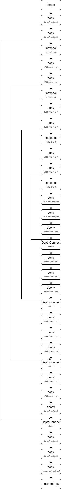
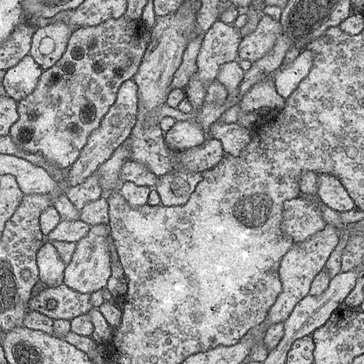
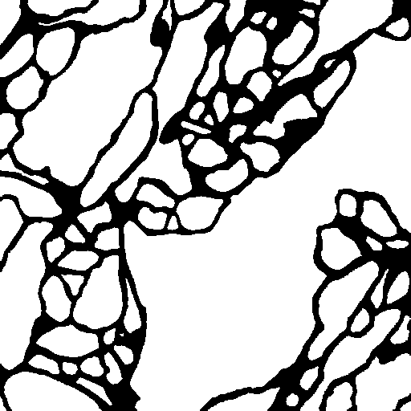
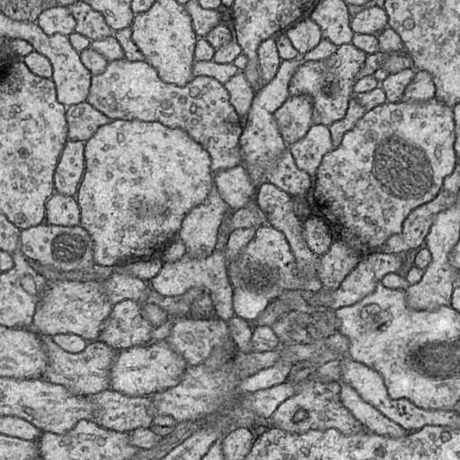
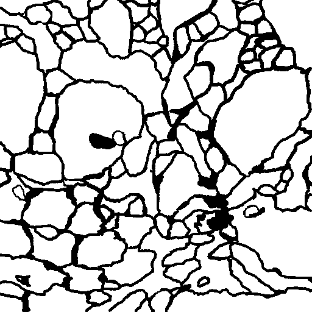
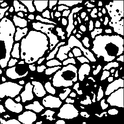

# UNet

U-Net是2015年提出的针对小数据集医学图像的语义分割CNN算法，因模型完美对称得名“U”，其最大的特点是参考googlenet将跳跃链接运用到语义分割领域，是语义分割领域的基线模型之一

其网络结构如下：



### 主要应用

医学图像：细胞分割、器官/肿瘤分割（MRI/CT）

通用分割：遥感、工业缺陷、自动驾驶道路/障碍物

图像生成：扩散模型（如 Stable Diffusion）的核心Backbone


### Inception模块构建

Lumos框架提供Inception模块帮助您实现跳跃链接

Lumos框架中数据按照[width:0,height:1,channel:2,batch:3]组织，所以inception_layer按照channel进行合并时，dim参数设置为2


### ISBI 2012 Cell（EM 神经元分割）数据集

该数据集包含单通道神经元灰度图像，U-Net原论文在该数据集上完成，下载地址如下

https://www.kaggle.com/datasets/hamzamohiuddin/isbi-2012-challenge






### 代码构建

使用Lumos框架构建网络模型

```c
int num_class = 2;
Graph *graph = create_graph();
Layer **layers = malloc(50*sizeof(Layer*));
layers[0] = make_convolutional_layer(64, 3, 1, 1, 1, "linear");
layers[1] = make_normalization_layer(0.1, 1, "relu");
layers[2] = make_convolutional_layer(64, 3, 1, 1, 1, "linear");
layers[3] = make_normalization_layer(0.1, 1, "relu");
// x1 256*256*64
layers[4] = make_maxpool_layer(2, 2, 0);
layers[5] = make_convolutional_layer(128, 3, 1, 1, 1, "linear");
layers[6] = make_normalization_layer(0.1, 1, "relu");
layers[7] = make_convolutional_layer(128, 3, 1, 1, 1, "linear");
layers[8] = make_normalization_layer(0.1, 1, "relu");
// x2 128*128*128
layers[9] = make_maxpool_layer(2, 2, 0);
layers[10] = make_convolutional_layer(256, 3, 1, 1, 1, "linear");
layers[11] = make_normalization_layer(0.1, 1, "relu");
layers[12] = make_convolutional_layer(256, 3, 1, 1, 1, "linear");
layers[13] = make_normalization_layer(0.1, 1, "relu");
// x3 64*64*256
layers[14] = make_maxpool_layer(2, 2, 0);
layers[15] = make_convolutional_layer(512, 3, 1, 1, 1, "linear");
layers[16] = make_normalization_layer(0.1, 1, "relu");
layers[17] = make_convolutional_layer(512, 3, 1, 1, 1, "linear");
layers[18] = make_normalization_layer(0.1, 1, "relu");
// x4 32*32*512
layers[19] = make_maxpool_layer(2, 2, 0);
layers[20] = make_convolutional_layer(1024, 3, 1, 1, 1, "linear");
layers[21] = make_normalization_layer(0.1, 1, "relu");
layers[22] = make_convolutional_layer(1024, 3, 1, 1, 1, "linear");
layers[23] = make_normalization_layer(0.1, 1, "relu");
// x5 16*16*1024
layers[24] = make_deconvolutional_layer(512, 2, 2, 0, 0, "linear");
// 32*32*512
Layer **up1 = malloc(2*sizeof(Layer*));
layers[25] = make_inception_layer(up1, 2, 2);
up1[0] = layers[19];
up1[1] = layers[25];
// 32*32*1024
layers[26] = make_convolutional_layer(512, 3, 1, 1, 1, "linear");
layers[27] = make_normalization_layer(0.1, 1, "relu");
layers[28] = make_convolutional_layer(512, 3, 1, 1, 1, "linear");
layers[29] = make_normalization_layer(0.1, 1, "relu");
// 32*32*512
layers[30] = make_deconvolutional_layer(256, 2, 2, 0, 0, "linear");
// 64*64*256
Layer **up2 = malloc(2*sizeof(Layer*));
layers[31] = make_inception_layer(up2, 2, 2);
up2[0] = layers[14];
up2[1] = layers[31];
// 64*64*512
layers[32] = make_convolutional_layer(256, 3, 1, 1, 1, "linear");
layers[33] = make_normalization_layer(0.1, 1, "relu");
layers[34] = make_convolutional_layer(256, 3, 1, 1, 1, "linear");
layers[35] = make_normalization_layer(0.1, 1, "relu");
// 64*64*256
layers[36] = make_deconvolutional_layer(128, 2, 2, 0, 0, "linear");
// 128*128*128
Layer **up3 = malloc(2*sizeof(Layer*));
layers[37] = make_inception_layer(up3, 2, 2);
up3[0] = layers[9];
up3[1] = layers[37];
// 128*128*256
layers[38] = make_convolutional_layer(128, 3, 1, 1, 1, "linear");
layers[39] = make_normalization_layer(0.1, 1, "relu");
layers[40] = make_convolutional_layer(128, 3, 1, 1, 1, "linear");
layers[41] = make_normalization_layer(0.1, 1, "relu");
// 128*128*128
layers[42] = make_deconvolutional_layer(64, 2, 2, 0, 0, "linear");
// 256*256*64
Layer **up4 = malloc(2*sizeof(Layer*));
layers[43] = make_inception_layer(up4, 2, 2);
up4[0] = layers[4];
up4[1] = layers[43];
// 256*256*128
layers[44] = make_convolutional_layer(64, 3, 1, 1, 1, "linear");
layers[45] = make_normalization_layer(0.1, 1, "relu");
layers[46] = make_convolutional_layer(64, 3, 1, 1, 1, "linear");
layers[47] = make_normalization_layer(0.1, 1, "relu");
// 256*256*64
layers[48] = make_convolutional_layer(num_class, 1, 1, 0, 1, "linear");
// 256*256*2
layers[49] = make_crossentropy_layer(NULL, -1);
```

unet完全由随机参数开始训练，且数据集极小，所以通常使用批次归一化稳定训练过程

unet模型中卷积层全部采用Kaiming初始化（bias置0），转置卷积层采用双线性插值初始化（无bias）

我们使用crossentropy分类器进行分类

接下来构建会话，并设置相关训练超参数

```c
Session *sess = create_session(graph, 256, 256, 1, 256*256, num_class, type, path);
float *mean = calloc(3, sizeof(float));
float *std = calloc(3, sizeof(float));
mean[0] = 0.485;
mean[1] = 0.456;
mean[2] = 0.406;
std[0] = 0.229;
std[1] = 0.224;
std[2] = 0.225;
transform_normalize_sess(sess, mean, std);
transform_resize_sess(sess, 256, 256);
set_train_params(sess, 50, 4, 4, 0.001);
SGDOptimizer_sess(sess, 0.99, 0, 0, 0, 0);
lr_scheduler_exponential(sess, 0.95);
init_session(sess, "./data/umd/train.txt", "./data/umd/train_label.txt");
train(sess);
```

可以看到我们对数据集进行了一定的预处理操作，首先对数据集进行归一化，归一化的分布来自于ImageNet数据集的先验计算结果，后续我们对数据集进行缩放，使其符合网络模型输入

我们使用SGD参数优化器进行参数优化

完整代码如下

```c
#include "unet.h"

void unet(char *type, char *path)
{
    int num_class = 2;
    Graph *graph = create_graph();
    Layer **layers = malloc(50*sizeof(Layer*));
    layers[0] = make_convolutional_layer(64, 3, 1, 1, 1, "linear");
    layers[1] = make_normalization_layer(0.1, 1, "relu");
    layers[2] = make_convolutional_layer(64, 3, 1, 1, 1, "linear");
    layers[3] = make_normalization_layer(0.1, 1, "relu");
    // x1 256*256*64
    layers[4] = make_maxpool_layer(2, 2, 0);
    layers[5] = make_convolutional_layer(128, 3, 1, 1, 1, "linear");
    layers[6] = make_normalization_layer(0.1, 1, "relu");
    layers[7] = make_convolutional_layer(128, 3, 1, 1, 1, "linear");
    layers[8] = make_normalization_layer(0.1, 1, "relu");
    // x2 128*128*128
    layers[9] = make_maxpool_layer(2, 2, 0);
    layers[10] = make_convolutional_layer(256, 3, 1, 1, 1, "linear");
    layers[11] = make_normalization_layer(0.1, 1, "relu");
    layers[12] = make_convolutional_layer(256, 3, 1, 1, 1, "linear");
    layers[13] = make_normalization_layer(0.1, 1, "relu");
    // x3 64*64*256
    layers[14] = make_maxpool_layer(2, 2, 0);
    layers[15] = make_convolutional_layer(512, 3, 1, 1, 1, "linear");
    layers[16] = make_normalization_layer(0.1, 1, "relu");
    layers[17] = make_convolutional_layer(512, 3, 1, 1, 1, "linear");
    layers[18] = make_normalization_layer(0.1, 1, "relu");
    // x4 32*32*512
    layers[19] = make_maxpool_layer(2, 2, 0);
    layers[20] = make_convolutional_layer(1024, 3, 1, 1, 1, "linear");
    layers[21] = make_normalization_layer(0.1, 1, "relu");
    layers[22] = make_convolutional_layer(1024, 3, 1, 1, 1, "linear");
    layers[23] = make_normalization_layer(0.1, 1, "relu");
    // x5 16*16*1024
    layers[24] = make_deconvolutional_layer(512, 2, 2, 0, 0, "linear");
    // 32*32*512
    Layer **up1 = malloc(2*sizeof(Layer*));
    layers[25] = make_inception_layer(up1, 2, 2);
    up1[0] = layers[19];
    up1[1] = layers[25];
    // 32*32*1024
    layers[26] = make_convolutional_layer(512, 3, 1, 1, 1, "linear");
    layers[27] = make_normalization_layer(0.1, 1, "relu");
    layers[28] = make_convolutional_layer(512, 3, 1, 1, 1, "linear");
    layers[29] = make_normalization_layer(0.1, 1, "relu");
    // 32*32*512
    layers[30] = make_deconvolutional_layer(256, 2, 2, 0, 0, "linear");
    // 64*64*256
    Layer **up2 = malloc(2*sizeof(Layer*));
    layers[31] = make_inception_layer(up2, 2, 2);
    up2[0] = layers[14];
    up2[1] = layers[31];
    // 64*64*512
    layers[32] = make_convolutional_layer(256, 3, 1, 1, 1, "linear");
    layers[33] = make_normalization_layer(0.1, 1, "relu");
    layers[34] = make_convolutional_layer(256, 3, 1, 1, 1, "linear");
    layers[35] = make_normalization_layer(0.1, 1, "relu");
    // 64*64*256
    layers[36] = make_deconvolutional_layer(128, 2, 2, 0, 0, "linear");
    // 128*128*128
    Layer **up3 = malloc(2*sizeof(Layer*));
    layers[37] = make_inception_layer(up3, 2, 2);
    up3[0] = layers[9];
    up3[1] = layers[37];
    // 128*128*256
    layers[38] = make_convolutional_layer(128, 3, 1, 1, 1, "linear");
    layers[39] = make_normalization_layer(0.1, 1, "relu");
    layers[40] = make_convolutional_layer(128, 3, 1, 1, 1, "linear");
    layers[41] = make_normalization_layer(0.1, 1, "relu");
    // 128*128*128
    layers[42] = make_deconvolutional_layer(64, 2, 2, 0, 0, "linear");
    // 256*256*64
    Layer **up4 = malloc(2*sizeof(Layer*));
    layers[43] = make_inception_layer(up4, 2, 2);
    up4[0] = layers[4];
    up4[1] = layers[43];
    // 256*256*128
    layers[44] = make_convolutional_layer(64, 3, 1, 1, 1, "linear");
    layers[45] = make_normalization_layer(0.1, 1, "relu");
    layers[46] = make_convolutional_layer(64, 3, 1, 1, 1, "linear");
    layers[47] = make_normalization_layer(0.1, 1, "relu");
    // 256*256*64
    layers[48] = make_convolutional_layer(num_class, 1, 1, 0, 1, "linear");
    // 256*256*2
    layers[49] = make_crossentropy_layer(NULL, -1);

    for (int i = 0; i < 50; ++i){
        append_layer2grpah(graph, layers[i]);
        Layer *l = layers[i];
        if (l->type == CONVOLUTIONAL){
            init_kaiming_uniform_kernel(l, 0, "fan_out", "relu");
            init_constant_bias(l, 0);
        }
        if (l->type == DECONVOLUTIONAL){
            init_bilinearinterp_kernel(l);
        }
    }
    Session *sess = create_session(graph, 256, 256, 1, 256*256, num_class, type, path);
    float *mean = calloc(3, sizeof(float));
    float *std = calloc(3, sizeof(float));
    mean[0] = 0.485;
    mean[1] = 0.456;
    mean[2] = 0.406;
    std[0] = 0.229;
    std[1] = 0.224;
    std[2] = 0.225;
    transform_normalize_sess(sess, mean, std);
    transform_resize_sess(sess, 256, 256);
    set_train_params(sess, 50, 4, 4, 0.001);
    SGDOptimizer_sess(sess, 0.99, 0, 0, 0, 0);
    lr_scheduler_exponential(sess, 0.95);
    init_session(sess, "./data/umd/train.txt", "./data/umd/train_label.txt");
    train(sess);
}

void unet_detect(char *type, char *path)
{
    int num_class = 2;
    Graph *graph = create_graph();
    Layer **layers = malloc(50*sizeof(Layer*));
    layers[0] = make_convolutional_layer(64, 3, 1, 1, 1, "linear");
    layers[1] = make_normalization_layer(0.1, 1, "relu");
    layers[2] = make_convolutional_layer(64, 3, 1, 1, 1, "linear");
    layers[3] = make_normalization_layer(0.1, 1, "relu");
    // x1 256*256*64
    layers[4] = make_maxpool_layer(2, 2, 0);
    layers[5] = make_convolutional_layer(128, 3, 1, 1, 1, "linear");
    layers[6] = make_normalization_layer(0.1, 1, "relu");
    layers[7] = make_convolutional_layer(128, 3, 1, 1, 1, "linear");
    layers[8] = make_normalization_layer(0.1, 1, "relu");
    // x2 128*128*128
    layers[9] = make_maxpool_layer(2, 2, 0);
    layers[10] = make_convolutional_layer(256, 3, 1, 1, 1, "linear");
    layers[11] = make_normalization_layer(0.1, 1, "relu");
    layers[12] = make_convolutional_layer(256, 3, 1, 1, 1, "linear");
    layers[13] = make_normalization_layer(0.1, 1, "relu");
    // x3 64*64*256
    layers[14] = make_maxpool_layer(2, 2, 0);
    layers[15] = make_convolutional_layer(512, 3, 1, 1, 1, "linear");
    layers[16] = make_normalization_layer(0.1, 1, "relu");
    layers[17] = make_convolutional_layer(512, 3, 1, 1, 1, "linear");
    layers[18] = make_normalization_layer(0.1, 1, "relu");
    // x4 32*32*512
    layers[19] = make_maxpool_layer(2, 2, 0);
    layers[20] = make_convolutional_layer(1024, 3, 1, 1, 1, "linear");
    layers[21] = make_normalization_layer(0.1, 1, "relu");
    layers[22] = make_convolutional_layer(1024, 3, 1, 1, 1, "linear");
    layers[23] = make_normalization_layer(0.1, 1, "relu");
    // x5 16*16*1024
    layers[24] = make_deconvolutional_layer(512, 2, 2, 0, 0, "linear");
    // 32*32*512
    Layer **up1 = malloc(2*sizeof(Layer*));
    layers[25] = make_inception_layer(up1, 2, 2);
    up1[0] = layers[19];
    up1[1] = layers[25];
    // 32*32*1024
    layers[26] = make_convolutional_layer(512, 3, 1, 1, 1, "linear");
    layers[27] = make_normalization_layer(0.1, 1, "relu");
    layers[28] = make_convolutional_layer(512, 3, 1, 1, 1, "linear");
    layers[29] = make_normalization_layer(0.1, 1, "relu");
    // 32*32*512
    layers[30] = make_deconvolutional_layer(256, 2, 2, 0, 0, "linear");
    // 64*64*256
    Layer **up2 = malloc(2*sizeof(Layer*));
    layers[31] = make_inception_layer(up2, 2, 2);
    up2[0] = layers[14];
    up2[1] = layers[31];
    // 64*64*512
    layers[32] = make_convolutional_layer(256, 3, 1, 1, 1, "linear");
    layers[33] = make_normalization_layer(0.1, 1, "relu");
    layers[34] = make_convolutional_layer(256, 3, 1, 1, 1, "linear");
    layers[35] = make_normalization_layer(0.1, 1, "relu");
    // 64*64*256
    layers[36] = make_deconvolutional_layer(128, 2, 2, 0, 0, "linear");
    // 128*128*128
    Layer **up3 = malloc(2*sizeof(Layer*));
    layers[37] = make_inception_layer(up3, 2, 2);
    up3[0] = layers[9];
    up3[1] = layers[37];
    // 128*128*256
    layers[38] = make_convolutional_layer(128, 3, 1, 1, 1, "linear");
    layers[39] = make_normalization_layer(0.1, 1, "relu");
    layers[40] = make_convolutional_layer(128, 3, 1, 1, 1, "linear");
    layers[41] = make_normalization_layer(0.1, 1, "relu");
    // 128*128*128
    layers[42] = make_deconvolutional_layer(64, 2, 2, 0, 0, "linear");
    // 256*256*64
    Layer **up4 = malloc(2*sizeof(Layer*));
    layers[43] = make_inception_layer(up4, 2, 2);
    up4[0] = layers[4];
    up4[1] = layers[43];
    // 256*256*128
    layers[44] = make_convolutional_layer(64, 3, 1, 1, 1, "linear");
    layers[45] = make_normalization_layer(0.1, 1, "relu");
    layers[46] = make_convolutional_layer(64, 3, 1, 1, 1, "linear");
    layers[47] = make_normalization_layer(0.1, 1, "relu");
    // 256*256*64
    layers[48] = make_convolutional_layer(num_class, 1, 1, 0, 1, "linear");
    // 256*256*2
    layers[49] = make_crossentropy_layer(NULL, -1);

    for (int i = 0; i < 50; ++i){
        append_layer2grpah(graph, layers[i]);
    }

    Session *sess = create_session(graph, 256, 256, 1, 256*256, num_class, type, path);
    float *mean = calloc(3, sizeof(float));
    float *std = calloc(3, sizeof(float));
    mean[0] = 0.485;
    mean[1] = 0.456;
    mean[2] = 0.406;
    std[0] = 0.229;
    std[1] = 0.224;
    std[2] = 0.225;
    transform_normalize_sess(sess, mean, std);
    transform_resize_sess(sess, 256, 256);
    set_detect_params(sess);
    init_session(sess, "./data/umd/train.txt", "./data/umd/train_label.txt");
    detect_segmentation(sess);
}
```

在Lumos框架中demo目录下，您能找到unet.c文件，这就是我们已实现的unet模型


### 结果展示





