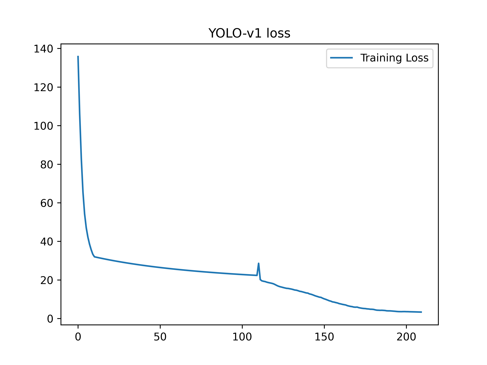
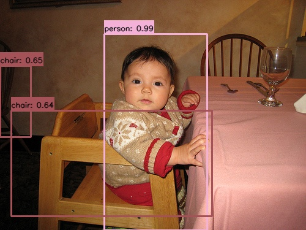
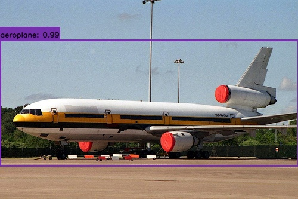
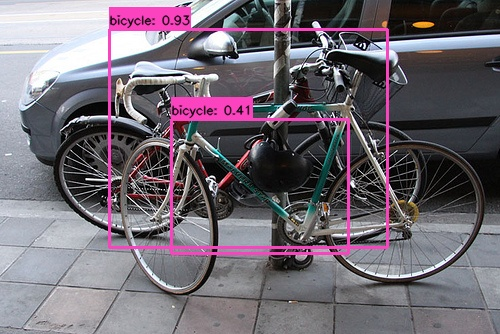
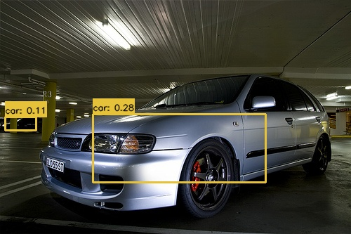
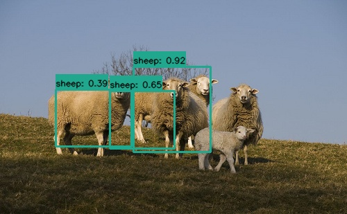

# YOLO-V1

YOLOv1（You Only Look Once v1）2015年问世，开山之作，首次把目标检测从「两阶段（候选框 + 分类）」改为一阶段端到端回归，速度远超 Faster R-CNN


### 网络结构

借鉴GoogleNet，自定义24层卷积+2层全连接，统称Darknet-24，输入固定尺寸448\*448\*3，在实现中可以采用任意您认为可行的卷积网络作为backbone

**核心创新**

yolov1输出张量为S\*S\*(B\*5+C)

- S：网格大小
- B：预测框数量
- C：类别数量

设B=2则每一个网格输出（x1,y1,w1,h1,x2,y2,w2,h2,confidence）

yolov1将图像划分为S\*S个网格，哪个格子包含物体中心点，哪个格子就负责预测该目标

每个网格中有B个预测框，并不是每个预测框都参与预测，而是选择IOU最大的那一个

**预测结果处理**

计算每一个预测框的得分：score=confidence*P(class_i|object)，设定阈值过滤低分框，最终利用NMS非极大值抑制，同类别重叠框保留最高分，剔除冗余框


### 损失函数设计

总损失 = 坐标损失 + 置信度损失（有目标 + 无目标）+ 分类损失

坐标损失：
$$
Loss_{xy}=(x_{i}-\hat{x}_{i})^{2}+(y_{i}-\hat{y}_{i})^{2} \\
Loss_{wh}=(\sqrt{w_{i}}-\sqrt{\hat{w}_{i}})^{2}+(\sqrt{h_{i}}-\sqrt{\hat{h}_{i}})^{2} \\
坐标损失：\lambda_{coord} Loss_{xy}+Loss_{wh}
$$
置信度损失：
$$
有目标置信度损失：(c_{i}-\hat{c}_{i})^{2} \\
无目标置信度损失：\lambda_{noobj} c_{i}^{2}(\hat{c}_{i}=0)
$$
分类损失：
$$
(p_{i}(c)-\hat{p_{i}}(c))^{2}
$$
超参数λcoord=5，λnoobj=0.5，由于大量预测框中没有目标，正负样本极度不均匀，加入超参数以平衡参数更新


### VOC2012数据集

PASCAL VOC（Visual Object Classes）是计算机视觉经典基准数据集，VOC2012是该系列最终稳定版本，广泛用于图像分类、目标检测、语义分割、实例分割、人体动作识别四大任务

官方主页：http://host.robots.ox.ac.uk/pascal/VOC/voc2012/

总图片数量：17125 张（train+val），压缩包约 1.9GB

适用场景：轻量模型训练、算法对比、入门实验；工业大数据场景一般搭配 COCO 使用

行业通用组合：VOC2007trainval + VOC2012trainval 混合训练，VOC2007 test 做评测

数据集包含20类图像，分割任务增加背景类为21类


### Lumos框架复现

框架提供yolov1与yolov1-tiny复现，优化损失计算

- Loss_xy：BCEWITHLOGISTIC
- Loss_wh：MSE
- Loss_classes：CrossEntropy
- Loss_conf：MSEWITHLOGISTIC

代码在yolo_layer.c中实现对应的cuda实现在yolo_layer_gpu.cu中

```c
#define MAX(x, y) ((x) > (y) ? (x) : (y))

float conf_msewithlogitsloss(float pred, float target)
{
    float input = 1 / (1 + exp(-pred));
    if (input < 1e-4) input = 1e-4;
    if (input > 1.0-(1e-4)) input = 1.0-(1e-4);
    float pos_id = (target==1.0)?1.0:0;
    float neg_id = (target==0.0)?1.0:0;

    float pos_loss = pos_id * pow(input-target, 2);
    float neg_loss = neg_id * pow(input, 2);

    float conf_loss = 5.0*pos_loss + 1.0*neg_loss;
    return conf_loss;
}

void conf_msewithlogitsloss_gradient(float pred, float target, float *space)
{
    float input = 1 / (1 + exp(-pred));
    if (input < 1e-4) input = 1e-4;
    if (input > 1.0-(1e-4)) input = 1.0-(1e-4);

    float pos_id = (target==1.0)?1.0:0;
    float neg_id = (target==0.0)?1.0:0;

    float pos_delta = pos_id * 2*(input-target);
    float neg_delta = neg_id * 2*input;

    float conf_delta = 5.0*pos_delta + 1.0*neg_delta;
    conf_delta *= (1-input)*input;
    space[0] = conf_delta/8;
}

float xy_bcewithlogitsloss(float px, float py, float tx, float ty, float box_scale_weight)
{
    float x_loss = 0;
    float y_loss = 0;
    x_loss = -px*tx + log(1+exp(px));
    y_loss = -py*ty + log(1+exp(py));
    float xy_loss = (x_loss + y_loss)*box_scale_weight;
    return xy_loss;
}

void xy_bcewithlogitsloss_gradient(float px, float py, float tx, float ty, float box_scale_weight, float *spacex, float *spacey)
{
    float x_delta = 0;
    float y_delta = 0;
    x_delta = 1 / (1 + exp(-px)) - tx;
    y_delta = 1 / (1 + exp(-py)) - ty;
    spacex[0] = x_delta*box_scale_weight/8;
    spacey[0] = y_delta*box_scale_weight/8;
}

float wh_mseloss(float pw, float ph, float tw, float th, float box_scale_weight)
{
    float w_loss = powf(pw-tw, 2);
    float h_loss = powf(ph-th, 2);
    float wh_loss = (w_loss + h_loss)*box_scale_weight;
    return wh_loss;
}

void wh_mseloss_gradient(float pw, float ph, float tw, float th, float box_scale_weight, float *spacew, float *spaceh)
{
    float w_delta = 2*(pw-tw);
    float h_delta = 2*(ph-th);
    spacew[0] = w_delta*box_scale_weight/8;
    spaceh[0] = h_delta*box_scale_weight/8;
}

float class_crossentropy(float *data, float truth, int w, int h, int c, int index)
{
    int target = (int)truth;
    float max_val = -INFINITY;
    float sum_exp = 0;
    for (int i = 0; i < c; ++i){
        max_val = MAX(max_val, data[i*w*h+index]);
    }
    for (int i = 0; i < c; ++i){
        sum_exp += expf(data[i*w*h+index]-max_val);
    }
    float loss = (-data[target*w*h+index]+max_val+log(sum_exp));
    return loss;
}

void class_crossentropy_gradient(float *data, float truth, int w, int h, int c, int index, float *space)
{
    int target = (int)truth;
    float max_val = -INFINITY;
    float sum_exp = 0;
    for (int i = 0; i < c; ++i){
        max_val = MAX(max_val, data[i*w*h+index]);
    }
    for (int i = 0; i < c; ++i){
        space[i*w*h+index] = expf(data[i*w*h+index]-max_val);
        sum_exp += space[i*w*h+index];
    }
    for (int i = 0; i < c; ++i){
        if (i == target) space[i*w*h+index] = (space[i*w*h+index]/sum_exp-1)/8;
        else space[i*w*h+index] = (space[i*w*h+index]/sum_exp)/8;
    }
}
```

yolov1复现采用resnet18作为backbone并采用SPP修改全连接层为卷积，yolov1-tiny采用原网络结构，除骨干网络需要加载预训练参数外，其余卷积层均采用Kaiming初始化，bias置0


### 结果展示





